# HanaChat —— AI 智能聊天平台

> **技术栈**：Spring Boot 4.0 + React 19 (TypeScript) + MySQL + ChromaDB + Docker  
> **角色**：全栈独立开发 | **代码规模**：后端 157 Java 类 / 前端 47 TypeScript 组件

---

## 一、项目概述

HanaChat 是一个**类 ChatGPT 的多模型 AI 聊天平台**，支持流式对话、RAG 知识库问答、长期记忆、提示词社区、Admin 后台管理、图像识别、联网搜索、好友系统、Token 计费充值等完整功能。项目采用前后端分离架构，部署于 Docker 容器化环境。

**核心能力**：
- 多模型接入（任意 OpenAI-compatible API），支持流式 SSE 与非流式两种模式
- 知识库 RAG 检索增强生成（ChromaDB 向量数据库 + 语义分块）
- 创新的人类记忆模型（自动提取 + 懒衰减 + 语义回溯）
- 完整的 LLMOps：预扣-实扣 Token 计费、孤儿余额回收、API Key 加密存储
- Admin 后台管理系统（10 个管理模块，仪表盘 / 用户 / 模型 / 审核全覆盖）
- 提示词社区（浏览发现 + 社交互动 + 创作者工作台 + 审核流程）
- 图像识别（上传 → S3 存储 → 视觉模型识别 → 自动注入对话上下文）
- 联网搜索（Tavily + 百度千帆 双引擎冗余，自动降级）

---

## 二、项目框架结构

### 2.1 后端架构（分层架构 + 门面模式）

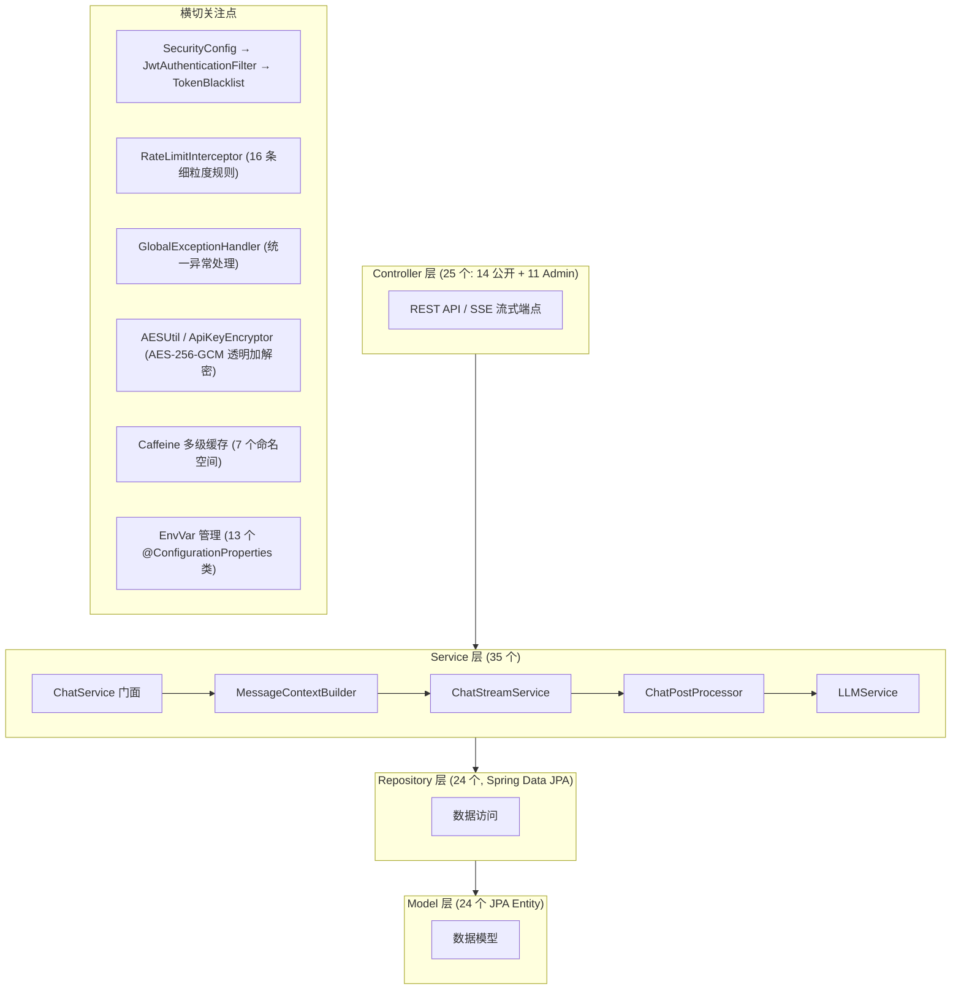

### 2.2 前端架构（React SPA + 渐进式迁移）

| 维度 | 新版前端 | 旧版前端（兼容保留） |
|------|---------|-------------------|
| 框架 | React 19 + TypeScript 6.0 | 原生 JS + Thymeleaf |
| 构建 | Vite 8 | 无构建 |
| 样式 | TailwindCSS 3 + shadcn/ui (Radix) | 手写 CSS |
| 状态管理 | React Context + Custom Hooks | 全局变量 |
| 路由 | react-router-dom 7 | 无 |
| 动画 | motion (Framer Motion) | 无 |
| 代码检查 | oxlint | 无 |
| 组件 | 47 个 tsx 文件（高度模块化） | 单体 JS 文件 |

### 2.3 数据层

- **MySQL 8.0**：24 张业务表，Flyway 版本化管理（7 个迁移脚本）
- **ChromaDB 0.6.3**：向量数据库，Collection 隔离（`kb_{id}` / `mem_{userId}`）
- **Caffeine**：7 个缓存命名空间，TTL 30s ~ 10min 按业务分级
- **S3 兼容存储**：图片上传（雨云 S3，AWS SDK）
- **环境变量管理**：13 个 @ConfigurationProperties 类替代裸 @Value，启动校验

### 2.4 运维部署

- `Dockerfile` + `docker-compose.yml`（app + MySQL + ChromaDB 三容器）
- ChromaDB 自动启动：`ChromaDBLauncher` 检测→拉子进程→`@PreDestroy` 销毁
- Flyway 手动配置（适配 Spring Boot 4.0 移除自动配置）

### 2.5 API 统一响应规范

项目定义了统一的 API 响应格式与 HTTP 状态码体系，确保前后端交互一致、可预期。

**成功响应** —— 使用 `ApiResponse<T>` 泛型封装：

```json
// 带数据返回
{"success": true, "data": {...}}

// 带消息返回
{"success": true, "message": "操作成功"}

// 纯成功确认
{"success": true}
```

`@JsonInclude(NON_NULL)` 确保 `data` / `message` 为 null 时不序列化，减少冗余字段。

**错误响应** —— 由 `@RestControllerAdvice` 全局异常处理器统一拦截：

| 异常类型 | HTTP 状态码 | 响应格式 | 场景 |
|----------|------------|---------|------|
| `BusinessException.badRequest()` | **400** | `{"success":false,"message":"..."}` | 参数校验、业务规则违反 |
| `BusinessException.notFound()` | **404** | 同上 | 资源不存在 |
| `BusinessException.forbidden()` | **403** | 同上 | 无权操作 |
| `BusinessException.conflict()` | **409** | 同上 | 重复操作（用户名已存在等） |
| `IllegalArgumentException` | **400** | `{"success":false,"message":"请求参数不合法"}` | 参数类型错误 |
| `@Valid` 校验失败 | **400** | `{"success":false,"error":"字段","message":"校验信息"}` | DTO Bean Validation |
| `InsufficientBalanceException` | **402** | `{"success":false,"message":"余额不足"}` | Token 余额不足 |
| `RuntimeException` 兜底 | **500** | `{"success":false,"message":"服务器内部错误"}` | 未知异常（内部详情仅记日志） |

**HTTP 状态码完整使用表**：

| 状态码 | 含义 | 典型场景 |
|--------|------|---------|
| **200** | 成功 | 所有正常响应 |
| **400** | 请求参数错误 | 验证码错误、密码错误、DTO 校验失败 |
| **401** | 未认证 | Token 无效/过期/缺失 |
| **402** | 余额不足 | Token 预扣失败 |
| **403** | 无权限 | 角色不足、账号被禁用 |
| **404** | 资源不存在 | 用户/会话/提示词/知识库不存在 |
| **409** | 冲突 | 重复注册、重复点赞收藏 |
| **429** | 请求过于频繁 | 速率限制触发 |
| **500** | 服务器内部错误 | 未知异常兜底 |

**全局异常处理链路**：

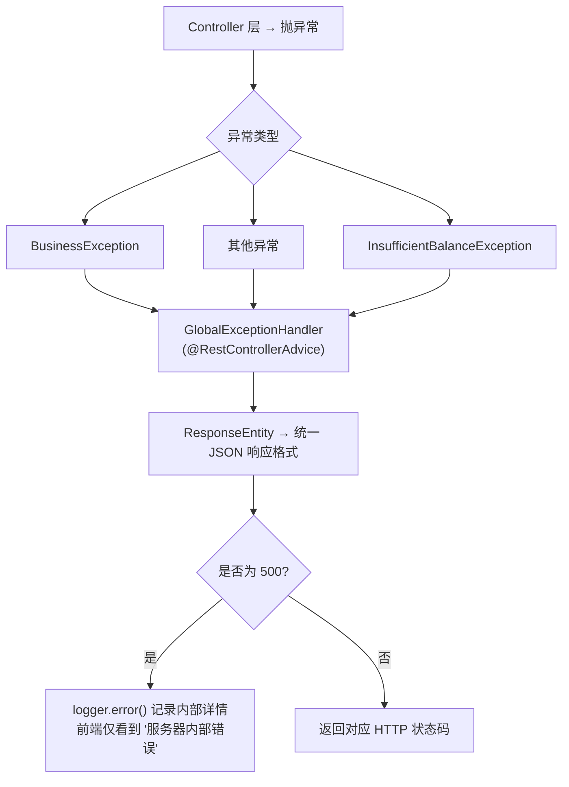

**设计要点**：
- `BusinessException` 自带 `HttpStatus`，通过 6 个工厂方法（`badRequest` / `notFound` / `forbidden` / `conflict` / `unauthorized` / `tooManyRequests`）创建，全项目 100+ 处使用
- 500 兜底**不泄露堆栈或内部细节**到前端，错误详情仅通过 `logger.error()` 记录服务端日志
- `InsufficientBalanceException` 返回 **402 Payment Required**，区别于通用 400，便于前端做余额引导页面跳转

---

## 三、安全防护

### 3.1 认证与授权

| 措施 | 实现 |
|------|------|
| JWT 认证 | HS256 签名，SHA-256 密钥扩展，24h 过期，无状态 Session |
| 角色授权 | USER / ADMIN 双角色，`/api/admin/**` 独立权限控制 |
| 登出失效 | Token 黑名单（SHA-256 哈希存储），双重保障 |
| 密码安全 | BCrypt 加密存储 |

### 3.2 Token 黑名单（双层保障）

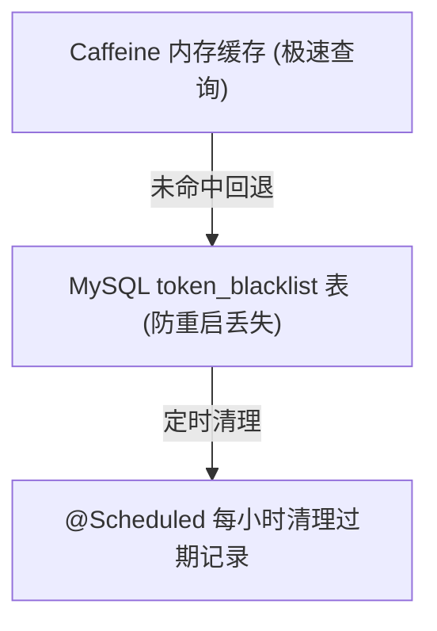

Token 以 SHA-256 哈希存入，**不存储原始 Token**，防止数据库泄露导致 Token 被还原。

### 3.3 API Key 加密存储

- **AES-256-GCM** 认证加密（12 字节随机 IV + 128 位认证标签）
- 通过 JPA `AttributeConverter` 实现**透明加解密**，业务代码无感知
- 启动时自动迁移明文历史数据（原生 SQL 绕过 JPA 脏检查）
- 密钥缺失时**拒绝启动**，防止未加密数据写入

### 3.4 速率限制

基于 Caffeine 滑动窗口令牌桶，**16 条精细化规则**：

| 端点 | 限制 | 窗口 |
|------|------|------|
| 聊天 (`/api/chat/*`) | 30 次 | 1 分钟 |
| 登录 | 5 次（管理员 3 次） | 1 分钟 |
| 验证码 | 1 次 | 1 分钟 |
| 重置密码验证码 | 1 次 | 1 分钟 |
| 注册 | 3 次 | 1 分钟 |
| 重置密码 | 5 次 | 1 分钟 |
| 头像上传 | 3 次 | 1 天 |
| 赞助上传 | 3 次 | 1 天 |
| 提示词评论 | 5 次 | 1 分钟 |
| 提示词上传 | 20 次 | 1 天 |
| 提示词点赞 | 10 次 | 1 分钟 |
| 提示词图片更新 | 10 次 | 1 天 |
| 知识库文档上传 | 50 次 | 1 天 |
| 图片上传 | 30 次 | 1 天 |

响应头返回 `X-RateLimit-Remaining` / `X-RateLimit-Reset` / `X-RateLimit-Limit`。

### 3.5 其他安全措施

- **安全响应头**：CSP / HSTS / X-Frame-Options / X-Content-Type-Options / XSS Protection
- **SSRF 防护**：`NetworkUtils.validateExternalUrl()` 拒绝内网/回环/保留地址
- **全局异常处理**：兜底 500 不泄露内部细节，区分 400/401/402/403/404/409/429
- **CORS 白名单**：`allowedOriginPatterns` 模式匹配，环境变量注入
- **前端 Token**：`sessionStorage` 存储（非 localStorage），减少 XSS 持久化风险
- **防分页信息泄露**：`@EnableSpringDataWebSupport(pageSerializationMode=VIA_DTO)`
- **文件上传防护**：路径穿越校验、类型白名单、大小限制
- **管理员操作审计**：`AdminOperationLog` 实体 + AOP 切面，异步记录 19 种管理操作，90 天自动清理

### 3.6 SQL 注入防护

项目采用**纵深防御**策略，从数据访问层到业务校验层多层次防护 SQL 注入：

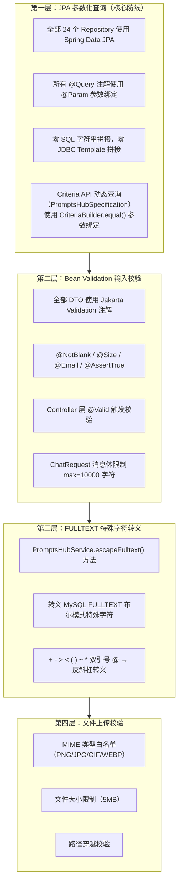

- **零 SQL 拼接**：项目未使用任何 JDBC Template 或字符串拼接 SQL，所有数据库操作均走 JPA 参数化查询
- **nativeQuery 安全**：`PromptsHubRepository` 中的 2 条 `nativeQuery=true` FULLTEXT 搜索使用 `@Param` 绑定，业务层 `escapeFulltext()` 转义特殊字符
- **JPA Specification 动态查询**：`PromptsHubSpecification` 使用 Criteria API 构建动态查询，`CriteriaBuilder.equal()` 天然防注入
- **DDL 安全**：`@Table(uniqueConstraints)` 数据库级唯一约束，`FetchType.LAZY` 防止 N+1 查询

---

## 四、特色功能

### 4.1 创新的人类记忆模型

不同于常规对话机器人仅依赖滑动窗口历史记录，HanaChat 实现了**模仿人类遗忘曲线的长期记忆系统**：

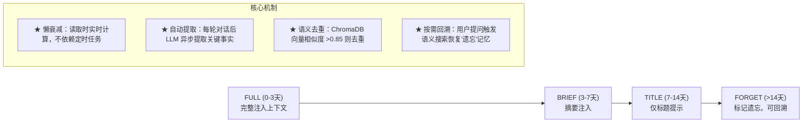

### 4.2 预扣-实扣双阶段计费

解决流式对话中 Token 消费不确定性的工程方案：

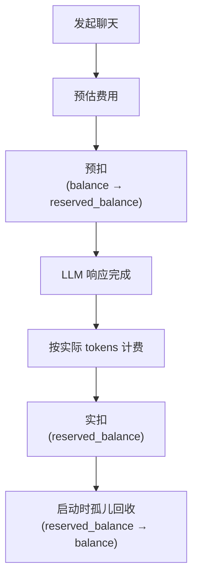

- **乐观锁** `@Version` 防止并发扣费
- **重试机制**：扣费失败自动重试
- **孤儿回收**：`CommandLineRunner` 启动时自动归还异常中断的预扣余额

### 4.3 消息上下文智能拼接

每条对话自动构建上下文数组，优先级从高到低：

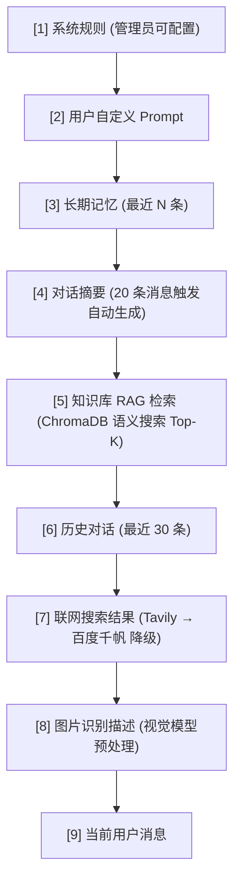

### 4.4 知识库 RAG

- 完整文档处理管道：上传 → 解析（PDFBox/纯文本）→ 语义分块（500 字符, 50 重叠）→ 向量化（bge-large-zh-v1.5, 1024 维）→ 存入 ChromaDB
- 每个知识库独立 ChromaDB Collection（命名 `kb_{id}`）
- 检索时语义搜索 Top-K 后注入对话上下文

### 4.5 流式 SSE 优化

- 直接使用 Apache HttpClient5 解析 SSE 流（不依赖 Spring AI 封装）
- 缓冲区优化：每 4 字符或有句子结束符时才 flush，减少 SSE 事件数量
- SseEmitter 超时 120s，兼容 Nginx 反向代理（`X-Accel-Buffering: no`）

### 4.6 提示词社区系统（PromptsHub）

一个完整的提示词分享与交流平台，用户可以浏览、创建、评价、收藏社区中的提示词。

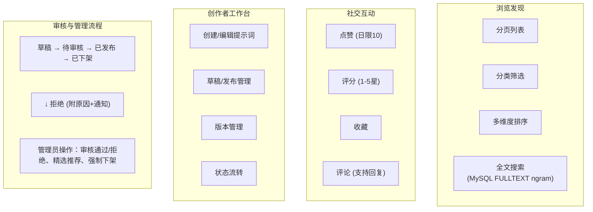

**核心特性**：
- **MySQL FULLTEXT 全文搜索**：基于 ngram parser 的中文分词搜索，支持布尔模式查询
- **状态流转**：草稿 → 待审核 → 已发布 → 已下架，完整的内容生命周期管理
- **互动系统**：点赞（日限 10 次防刷）、评分（1-5 星，异步重算均分）、收藏、评论（支持嵌套回复）
- **创作者工作台**：用户可管理自己创建的提示词，支持草稿编辑与版本迭代
- **精选推荐**：管理员可将优质提示词设为精选，在首页展示
- **封面图片**：支持用户上传自定义封面或随机选取预设封面
- **使用历史**：记录用户互动行为（点赞、评分、收藏），支持查看与清除

### 4.7 Admin 后台管理系统

独立的后台管理面板，为平台运营者提供完整的系统管理能力。

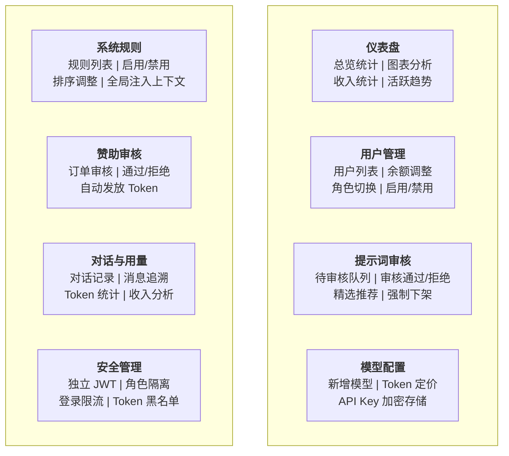

**核心特性**：
- **11 个 Admin Controller**，覆盖仪表盘、用户、提示词、模型、规则、对话、用量、赞助审核、审计日志、API 测试全流程
- **独立认证体系**：`/api/admin/**` 路径独立权限控制，仅 `ROLE_ADMIN` 可访问，登录限流更严格（3 次/分钟 vs 普通用户 5 次/分钟）
- **仪表盘可视化**：总用户数、总对话数、总消息数、总收入、今日新增、ECharts 图表趋势分析
- **用户精细管理**：支持按关键词搜索、分页浏览、余额调整、角色升降、账号启用/禁用
- **操作审计**：AOP 注解声明式记录 19 种管理操作，异步写入，90 天自动清理
- **模型动态配置**：管理员可随时新增/编辑/删除 AI 模型配置（API URL、API Key、模型名称、Token 定价），配置变更实时生效
- **系统规则管理**：全局系统提示词规则，支持启用/禁用和排序，自动注入每条对话的上下文
- **赞助审核流程**：用户充值后需管理员审核，通过后自动发放 Token 余额
- **对话追溯**：管理员可查看任意用户的对话记录和消息详情

### 4.8 图像识别功能

支持用户在对话中上传图片，由视觉模型自动识别图片内容并融入对话上下文。

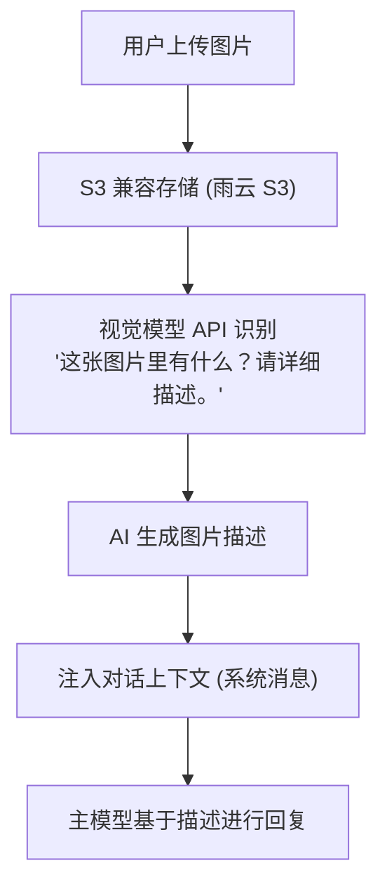

**核心特性**：
- **S3 兼容存储**：基于 AWS S3 SDK，图片上传至 S3 兼容对象存储，返回公开访问 URL
- **视觉模型识别**：调用 OpenAI-compatible 视觉模型 API，将图片转为自然语言描述
- **自动上下文注入**：识别结果以系统消息格式注入对话消息数组，主聊天模型可感知图片内容
- **前端预览**：上传后实时显示图片缩略图预览，支持清除重新上传
- **安全校验**：MIME 类型白名单（仅 `image/*`）、文件大小限制

### 4.9 联网搜索功能

支持用户在对话中一键开启联网搜索，实时获取最新信息辅助 AI 回答。

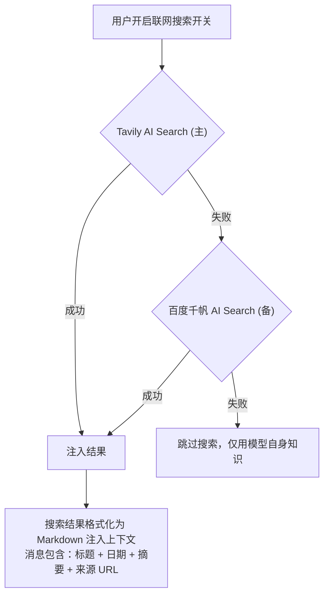

**核心特性**：
- **双引擎冗余**：Tavily AI Search 为主搜索引擎，百度千帆 AI Search 为自动降级备选
- **国际化支持**：Tavily 擅长英文互联网搜索，百度千帆覆盖国内中文内容
- **Markdown 格式化**：搜索结果以结构化 Markdown 格式注入对话上下文，包含标题、发布日期、内容摘要和来源链接
- **智能降级**：主引擎失败时自动切换到备选引擎，无需用户干预；双引擎均失败时静默跳过
- **前端开关控制**：用户可随时通过界面切换按钮开启/关闭联网搜索，灵活控制
- **独立 API**：`/api/search/web` 和 `/api/search/tavily` 端点支持独立调用搜索功能

### 4.10 API Key 加密迁移

启动时自动检测数据库中的 API Key 状态：
- 明文 → AES 加密（原生 SQL 批量更新）
- 已加密正确 → 跳过
- 密钥不匹配 → 记录 WARN 日志，不破坏数据

### 4.11 好友系统与私聊

完整的社交关系链，支持用户间添加好友和一对一会话。

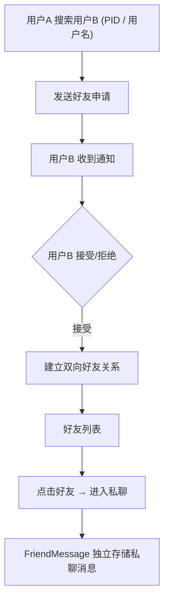

**核心特性**：
- **好友搜索**：按 PID 或用户名搜索用户，支持模糊匹配
- **申请流程**：发送 → 待审核 → 接受/拒绝，全链路通知
- **私聊对话**：好友之间独立的一对一会话，消息通过 `FriendMessage` 实体存储
- **好友列表**：侧边栏展示好友列表，在线状态实时可见

### 4.12 通知系统

统一的消息通知中心，覆盖系统内各类事件推送。

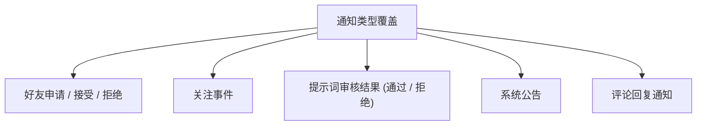

**核心特性**：
- **未读计数**：Header 角标实时显示未读通知数
- **批量标记已读**：支持一键全部已读
- **分页历史**：通知列表支持分页浏览历史记录
- **独立 API**：`/api/notifications` 端点管理通知全生命周期

### 4.13 对话摘要系统

自动为长对话生成摘要，优化上下文窗口利用率。

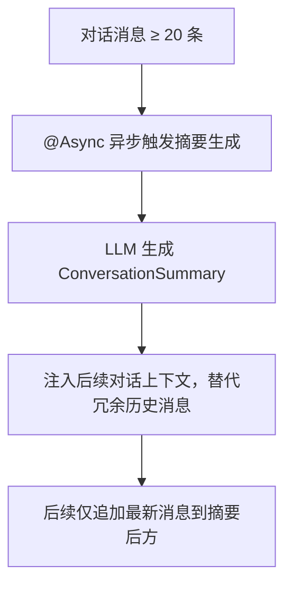

**核心特性**：
- **异步生成**：不阻塞对话主流程，用户无感知
- **智能触发**：消息达到阈值自动触发，摘要后继续追加增量消息
- **上下文优化**：摘要替代早期消息，节省 Token 消耗

### 4.14 管理员操作审计

完整的后台操作追溯体系，确保管理行为可审计、可回溯。

**审计覆盖 19 种操作**：用户管理（余额调整、角色变更、禁用/启用）、提示词审核（通过/拒绝、精选、下架）、模型配置变更、系统规则变更、赞助审核等。

- **AOP 切面**：`@AdminOperation` 注解声明式记录，业务代码零侵入
- **异步写入**：`@Async` + `REQUIRES_NEW` 事务隔离，不阻塞主流程
- **自动清理**：`@Scheduled` 定时任务 90 天自动清理过期审计日志

---

## 五、系统可观测性

项目构建了日志规范、异步任务追踪、健康检查等可观测性基础设施，确保系统运行状态透明可查。

### 5.1 日志规范

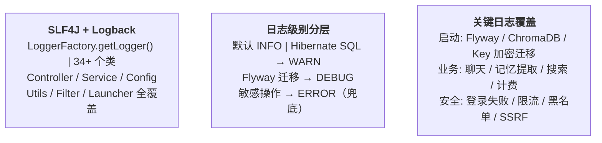

- **统一规范**：全部模块使用 `LoggerFactory.getLogger(ClassName.class)` 声明 Logger，风格一致
- **分层管理**：Hibernate SQL / 参数绑定设为 WARN 级别，避免生产环境日志洪流；Flyway 迁移设为 DEBUG 保障可视化
- **全局异常兜底**：`GlobalExceptionHandler` 对未预期异常统一 `logger.error("服务器内部错误", e)`，确保不漏报

### 5.2 @Async 异步任务与线程池隔离

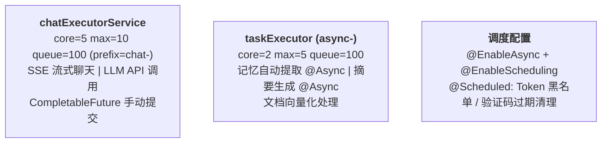

**线程池隔离设计**：
- **`chatExecutorService`**（核心 5 / 最大 10 / 队列 100）：专门处理 LLM 流式调用与 SSE 推送，与用户请求线程隔离，避免阻塞 Tomcat 线程池
- **`taskExecutor`**（核心 2 / 最大 5 / 队列 100）：处理 @Async 标注的异步后处理任务（记忆提取、摘要生成），保证对话主流程不因后处理卡顿
- **CompletableFuture 补充**：`LLMService` 使用 `CompletableFuture.supplyAsync()` 手动提交到 `chatExecutorService`，灵活控制超时与回调

**平滑关闭**：`chatExecutorService` 配置 `waitForTasksToCompleteOnShutdown=true` + `awaitTerminationSeconds=30`，确保 shutdown 时不丢失进行中的流式任务。

### 5.3 健康检查与指标监控

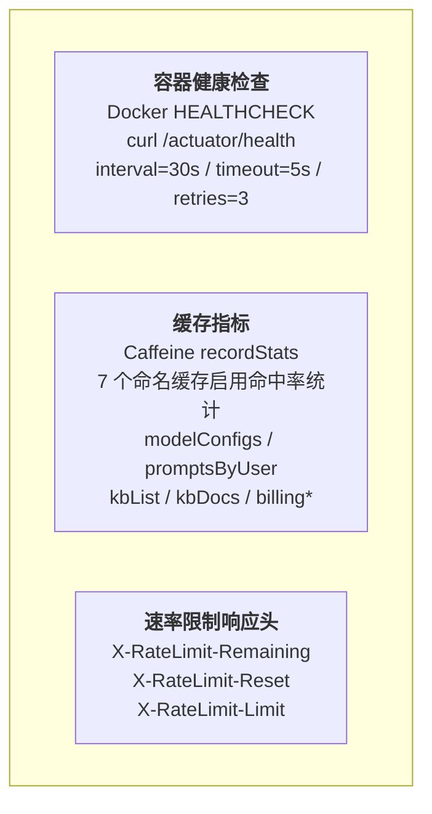

- **Docker 健康检查**：30s 间隔探测 `/actuator/health`，失败 3 次自动重启容器
- **Caffeine 缓存统计**：7 个命名缓存全部启用 `recordStats()`，支持命中率/加载时间等指标
- **速率限制可观测**：`RateLimitInterceptor` 响应头实时告知客户端剩余配额和重置时间
- **JVM 指标**：ZGC 低延迟垃圾回收器，`-XX:MaxGCPauseMillis=50` 保证响应时间稳定

---

## 六、性能优化

项目从缓存、线程池、连接池、数据库、前端、JVM 六个层面进行了系统性的性能优化。

### 6.1 多级缓存体系

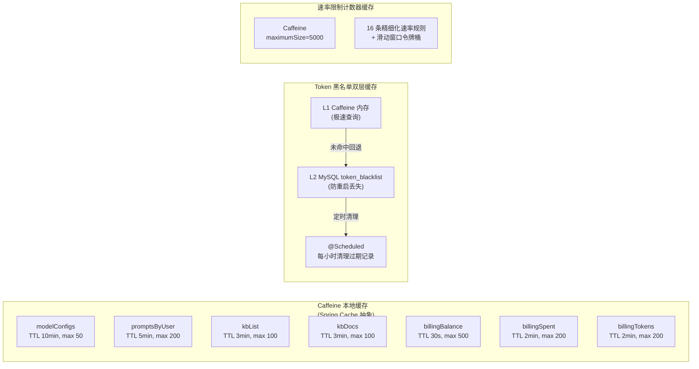

**@Cacheable / @CacheEvict 分布**：
- **`BillingService`**：余额 / 消费 / Token 三项缓存，扣费时精准 `@CacheEvict`
- **`KnowledgeBaseService`**：kbList / kbDocs 缓存，知识库增删改时级联清除
- **`PromptService`**：promptsByUser 缓存，提示词变更时清除
- **`AdminService`**：modelConfigs 缓存，配置变更时 `allEntries=true` 全量刷新

**TTL 分级策略**：余额 30s（高频轮询）、知识库 3min（低频变更）、模型配置 10min（变更极少）。

### 6.2 线程池与异步优化

| 线程池 | 核心/最大 | 队列 | 用途 | 关键配置 |
|--------|----------|------|------|---------|
| `chatExecutorService` | 5/10 | 100 | LLM 流式调用 + SSE | `waitForTasksToCompleteOnShutdown=true` |
| `taskExecutor` | 2/5 | 100 | @Async 后处理（记忆/摘要） | 通用异步任务 |
| HttpClient5 连接池 | maxTotal=50 | maxPerRoute=20 | LLM API HTTP 调用 | connectTimeout=10s, readTimeout=120s |

**异步后处理优化**：`ChatPostProcessor.triggerAsyncProcessing()` 在对话完成后异步触发记忆提取 + 摘要生成，不阻塞用户看到回复。

### 6.3 数据库优化

- **JPA 懒加载**：全部 `@ManyToOne` 关联使用 `FetchType.LAZY`，避免不必要的 JOIN
- **唯一约束**：`Follow` / `Favorite` 实体定义 `@Table(uniqueConstraints)`，数据库级防止脏数据
- **聚合查询优化**：知识库文档统计使用单次 `GROUP BY` 聚合消除 N+1
- **悲观锁**：`ConversationRepository` 使用 `@Lock(PESSIMISTIC_WRITE)` + `@QueryHints(@QueryHint(name="jakarta.persistence.lock.timeout", value="3000"))` 防止并发冲突
- **SQL 静默**：`show-sql=false` + Hibernate SQL/参数绑定 WARN 级别，消除生产日志噪音
- **索引优化**：已新增 10 个索引消除全表扫描，MySQL 参数调优（`innodb_buffer_pool_size`、`binlog_expire`、`flush_log` 等）

### 6.4 前端性能优化

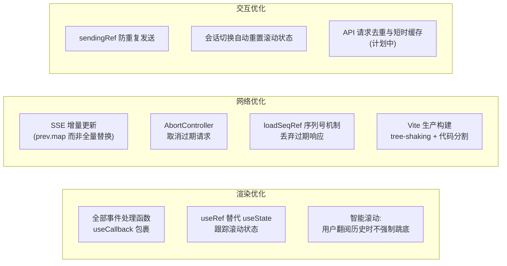

### 6.5 JVM 与容器优化

| 维度 | 配置 | 说明 |
|------|------|------|
| **GC** | `-XX:+UseZGC -XX:MaxGCPauseMillis=50` | Java 17 ZGC 低延迟回收器，目标 <50ms 暂停 |
| **堆内存** | `-Xmx512m` | 512MB 最大堆，适合中小规模部署 |
| **容器限制** | app 1GB / MySQL 1GB / ChromaDB 512MB | Docker Compose 资源隔离 |
| **健康检查** | 30s 间隔 / 5s 超时 / 3 次重试 | 自动故障恢复 |

- **Dockerfile 多阶段构建**（计划中）：缩减最终镜像体积
- **ZGC 选择理由**：AI 聊天场景对延迟敏感，ZGC 的亚毫秒级 STW 远超 G1/CMS
- **Gzip 压缩**（待配置）：`server.compression.enabled=true` 可进一步减少 API 响应体积

---

## 七、与常规项目的对比与优势

### 7.1 vs 常规 Spring Boot CRUD 项目

| 维度 | 常规 CRUD 项目 | HanaChat |
|------|---------------|----------|
| 架构复杂度 | 简单三层，无状态 | 门面模式 + 异步后处理 + 多线程隔离 |
| 数据库 | 单一 MySQL | MySQL + ChromaDB 向量数据库双存储 |
| AI 集成 | 无 | 多模型配置、流式 SSE、Token 计费 |
| 安全性 | 基础登录 | JWT + 黑名单 + AES-GCM + 速率限制 + SSRF 防护 |
| 部署 | 单机 jar | Docker Compose 三容器编排 |

### 7.2 vs 常规 AI Chat 套壳项目

| 维度 | 常见套壳项目 | HanaChat |
|------|------------|----------|
| 记忆系统 | 仅滑动窗口历史 | 人类遗忘曲线模型：自动提取 + 懒衰减 + 语义回溯 |
| 知识库 | 简单的全文搜索 | ChromaDB 语义向量检索 + 分块策略 |
| 计费 | 无或简单计数 | 预扣-实扣双阶段 + 乐观锁 + 孤儿回收 |
| 多模型 | 单模型硬编码 | 管理员动态配置任意 OpenAI-compatible API |
| API Key 安全 | 明文存储 | AES-256-GCM 透明加解密 |
| 流式处理 | 依赖框架默认 | 自实现 SSE 解析 + 缓冲区优化 |
| 社交功能 | 无 | 好友私聊 + 关注 + 通知 + 提示词社区 |
| 运维能力 | 无 | Flyway 迁移 + 管理审计 + 安全响应头 + 健康检查 |

### 7.3 核心优势总结

1. **LLMOps 完整性**：从模型配置、API Key 加密、流式/非流式双模式、到 Token 计费全链路打通
2. **安全纵深防御**：认证→授权→加密→限流→安全响应头→SSRF 防护→审计日志→异常屏蔽，多层安全体系
3. **创新的记忆系统**：模拟人类遗忘曲线，非简单的对话历史窗口
4. **工程化程度高**：Flyway 数据库版本管理、Caffeine 多级缓存、线程池隔离、@ConfigurationProperties 类型安全配置、全局异常处理
5. **渐进式前端迁移**：从 Thymeleaf 到 React 19 的技术演进实践
6. **容器化部署**：Docker Compose 一键启动，ChromaDB 自动生命周期管理
7. **完整的社交生态**：好友系统、私聊、关注、通知、提示词社区互动

### 7.4 技术难点攻克

| 难点 | 解决方案 |
|------|---------|
| 流式对话计费不精确 | 预扣-实扣双阶段 + 乐观锁 + 启动孤儿回收 |
| 服务重启 Token 黑名单丢失 | Caffeine 内存 + MySQL 持久化双层保障 |
| API Key 明文泄露风险 | AES-256-GCM 认证加密 + JPA 透明转换器 |
| 记忆随时间衰减 | 懒衰减算法（读取时计算，零定时任务开销） |
| Spring Boot 4.0 移除 Flyway 自动配置 | 手动 Flyway Bean + `@DependsOn` 确保迁移先于 JPA |
| 多模型 API URL 可能导致 SSRF | `NetworkUtils` 启动时校验，拒绝内网地址 |
| SSE 事件过多导致性能问题 | 缓冲区 4 字符 + 句子结束符检测优化 |
| 30+ 环境变量散落 @Value | 13 个 @ConfigurationProperties + 启动校验 |
| 管理操作无法追溯 | AOP 切面 + @Async 审计日志 + 90 天自动清理 |

---

## 八、技术栈总览

| 层级 | 技术 |
|------|------|
| **后端框架** | Spring Boot 4.0.6, Spring Security, Spring Data JPA, Spring AI 2.0 |
| **语言** | Java 17 |
| **数据库** | MySQL 8.0 (Flyway 7 次迁移), ChromaDB 0.6.3 (向量) |
| **缓存** | Caffeine (本地), Spring Cache 抽象 |
| **认证** | JJWT 0.12.6 (HS256), BCrypt, AES-256-GCM |
| **前端** | React 19, TypeScript 6.0, Vite 8, TailwindCSS 3, shadcn/ui (Radix), react-router-dom 7, motion |
| **模板引擎** | Thymeleaf (旧版前端兼容) |
| **HTTP 客户端** | Apache HttpClient5 (连接池) |
| **存储** | AWS S3 SDK (雨云 S3 兼容) |
| **邮件** | Spring Mail (QQ SMTP) |
| **环境管理** | spring-dotenv + 13 个 @ConfigurationProperties |
| **构建** | Maven |
| **部署** | Docker + Docker Compose |
