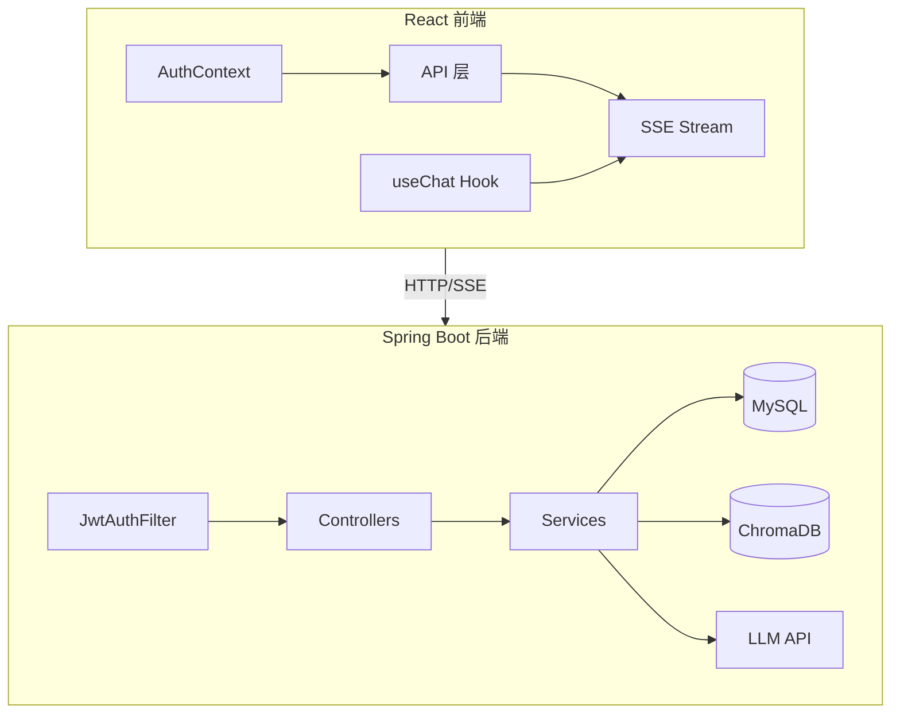

# 项目审查报告（已全部修复）

审查范围：后端 66 个 Java 文件 + 前端 20 个 TS/TSX 文件，共发现 **22 个问题**。经过 3 轮修复 + 3 轮自检，全部问题已解决。累计修改 **21 个文件**，新增 **3 个文件**。

---

## 概览架构图

---

## 修复总览

| 等级 | 数量 | 状态 |
|------|------|------|
| Critical | 7 | 已修复 |
| Major | 10 | 已修复 |
| Minor | 5 | 已修复 |
| **合计** | **22** | **全部已修复** |

---

## Critical（7 项 — 已修复）

### #1 计费乐观锁重试完全失效 ✅
**文件**: `BillingService.java`

**问题**: `deductTokens` 和 `doDeductTokens` 均为 `@Transactional`（默认 `REQUIRED`），`OptimisticLockException` 导致事务标记为 rollback-only，重试循环无效。

**修复**:
- `doDeductTokens` 改为 `@Transactional(propagation = Propagation.REQUIRES_NEW)`
- 添加 `@Lazy @Autowired private BillingService self` 自注入，通过 `self.doDeductTokens()` 绕过 Spring AOP 自调用限制，确保 `REQUIRES_NEW` 生效

---

### #2 注册接口无密码强度校验 ✅
**文件**: `UserService.java`

**问题**: `register()` 跳过 `validatePasswordStrength()`，可注册弱密码。

**修复**: 在 `passwordEncoder.encode()` 之前添加 `validatePasswordStrength(request.getPassword())`。

---

### #3 流式断开时扣费不执行 ✅
**文件**: `ChatStreamService.java`

**问题**: 用户断网/关闭浏览器后 `emitter` 回调不触发扣费。

**修复**:
- 使用 `AtomicBoolean billingDone` + `AtomicLong promptTokensRef/completionTokensRef` 追踪状态
- 注册 `emitter.onCompletion(doBilling)` 和 `emitter.onTimeout(doBilling)` 回调
- `compareAndSet` 防止重复扣费；正常流程 `doBilling.run()` 完成后，回调不再执行

---

### #4 LLMService 线程池死锁风险 ✅
**文件**: `LLMService.java`

**问题**: `chatSync` 向 `chatExecutorService` 提交任务后 `join()`，若调用方在同一线程池可能导致死锁。

**修复**: `chatSync` 改用 `CompletableFuture.supplyAsync(() -> syncCall(messages, config)).join()`，使用 `ForkJoinPool.commonPool()` 隔离执行，新增 `syncCall()` 直接同步调用 LLM API。

---

### #5 refreshUser 任何错误都清除 Token ✅
**文件**: `auth.tsx`

**问题**: 网络抖动等非认证错误也清除 Token 强制登出。

**修复**: catch 中检查 `e instanceof ApiError && e.status === 401`，仅认证失败时清除 Token。

---

### #6 useChat 会话切换不停止旧流 ✅
**文件**: `useChat.ts`

**问题**: 切换会话时旧 SSE 流继续更新 `setMessages`，消息混乱。

**修复**:
- `handleSend` 开头检查并 abort 上一个 `AbortController`
- catch 中忽略 `AbortError`（`DOMException && name === "AbortError"`），不显示错误提示
- 同步修复了 #11（handleStop 误报"请求失败"）

---

### #7 流式生成期间用户无法上滚 ✅
**文件**: `ChatMessages.tsx`

**问题**: `messages` 每次变化都 `scrollIntoView`，强制拉回底部。

**修复**:
- 添加 `isUserScrollingUp` ref + `isNearBottom`（阈值 80px）检测用户意图
- `useEffect` 仅在用户未上滚时自动滚动
- 切换会话时通过 `prevFirstMsgId` 检测并重置滚动状态

---

## Major（10 项 — 已修复）

### #8 Token 黑名单仅内存存储 ✅
**文件**: `TokenBlacklist.java` + 新增 `TokenBlacklistEntry.java` + `TokenBlacklistEntryRepository.java`

**问题**: 服务重启后所有已登出 Token 恢复有效。

**修复**: 双层保障 — Caffeine 内存缓存（快速）+ MySQL `token_blacklist` 表（持久化，SHA-256 hash 唯一索引）。`isBlacklisted()` 先查内存，未命中回退查 DB。

---

### #9 黑名单容量仅 1000 条 ✅
**文件**: `TokenBlacklist.java`

**问题**: LRU 淘汰导致旧 Token 恢复有效。

**修复**: 移除 `.maximumSize(1000)`，仅依赖 `expireAfterWrite`（对齐 JWT 过期时间）。新增 `@Scheduled` 每小时清理 DB 过期记录。

---

### #10 日志多处泄露邮箱 PII ✅
**文件**: `UserService.java`

**问题**: 8 处日志直接记录邮箱地址。

**修复**: 新增 `maskEmail()` 方法（`"user@example.com"` → `"u***@example.com"`）。非邮箱字符串（无 `@`）原样返回，不影响用户名日志。

---

### #11 handleStop 后仍显示"请求失败" ✅
**文件**: `useChat.ts`

**问题**: `handleStop` → `abort()` → `AbortError` → catch 显示错误。

**修复**: 在 #6 中同步修复 — catch 中检测 `DOMException && AbortError` 后静默返回。

---

### #12 useConversations 快速切换会话竞态 ✅
**文件**: `useConversations.ts` + `App.tsx`

**问题**: 多个 `loadHistory` 并发，网络延迟不确定导致消息覆盖。

**修复**: `loadSeqRef` 递增序号，过期响应返回 `null`。App.tsx 中 `msgs !== null` 时才 `setMessages`，避免清空当前会话消息。

---

### #13 ChatService 先保存再扣费 ✅
**文件**: `ChatService.java` + `BillingService.java`

**问题**: 先保存消息再扣费，扣费异常被静默忽略。

**修复**:
- 顺序调整为：预扣余额 → LLM 调用 → 实际扣费 → 保存消息
- 扣费异常不再静默吞掉，直接抛出
- 新增 `releaseReservedBalance()` 方法，try-catch 包裹 LLM+扣费，异常时主动释放预留余额

---

### #14 ConversationService 创建会话竞态 ✅
**文件**: `ConversationService.java` + `ConversationRepository.java`

**问题**: count 检查和 save 之间无原子保护。

**修复**: `createConversation` 添加 `@Transactional`，使用 `countByUserIdForUpdate`（`PESSIMISTIC_WRITE`，3s 超时）锁定用户会话行。

---

### #15 MemoryService 先删 ChromaDB 再删 MySQL ✅
**文件**: `MemoryService.java`

**问题**: 先删外部 ChromaDB（不可回滚），再删 MySQL。MySQL 失败时 ChromaDB 数据已丢失。

**修复**: 先删 MySQL（事务内可回滚），成功后再删 ChromaDB。

---

### #16 KnowledgeBaseService N+1 查询 ✅
**文件**: `KnowledgeBaseService.java` + `KbDocumentRepository.java`

**问题**: 每个知识库执行 3 次聚合查询，O(3N)。

**修复**: 新增 `aggregateByKbIds` 单次 `GROUP BY` 查询，空列表提前返回避免 `IN ()` 无效 SQL。

---

### #17 IllegalArgumentException 异常信息透传 ✅
**文件**: `GlobalExceptionHandler.java`

**问题**: `e.getMessage()` 可能泄露内部路径。

**修复**: 返回通用消息 `"请求参数不合法"`，错误详情通过 `logger.warn` 记录。

---

## Minor（5 项 — 已修复）

### #18 DTO 校验与 Service 不一致 ✅
**文件**: `ChangePasswordRequest.java` + `RegisterRequest.java`

**问题**: `@Size(min=6)` 与 `validatePasswordStrength()` 的 `min=8` 不一致。

**修复**: 统一改为 `@Size(min=8)`，同步更新 `ProfileModal.tsx` 前端提示文案为"至少8位"。

---

### #19 Thread.sleep 阻塞线程池 ✅
**文件**: `ChatStreamService.java`

**问题**: 每个 chunk 发送后 `Thread.sleep(50)` 阻塞工作线程。

**修复**: 移除 `sleepMs` 变量及 `Thread.sleep` 调用。`flushEvery=4` 已限制最小 chunk 大小。

---

### #20 BufferedReader 未使用 try-with-resources ✅
**文件**: `ChatStreamService.java`

**问题**: `reader.close()` 手动调用，异常路径可能泄漏。

**修复**: `BufferedReader` 移入嵌套 try-with-resources（与 `CloseableHttpResponse` 双层），`fullResponse`/`chunkBuf` 提升至外层作用域。

---

### #21 ProfileModal 密码明文在 React 状态 ✅
**文件**: `ProfileModal.tsx`

**问题**: 密码存储在 `useState`，React DevTools 可查看。

**修复**: `pwVerify`/`pwNew`/`pwConfirm` 改为 `useRef<HTMLInputElement>`（非受控组件）。新增 `pwVerifyValueRef` 保存已验证密码字符串，避免 DOM unmount 后值丢失。

---

### #22 ProfileModal useState 不随 prop 更新 ✅
**文件**: `ProfileModal.tsx`

**问题**: `useState(signature)` 仅读取初始值，父组件更新 prop 后不同步。

**修复**: 添加 `useEffect(() => { setSigValue(signature); }, [signature])`。

---

## 修改文件清单

### 后端（17 文件修改 + 3 新增）

| 文件 | 涉及问题 |
|------|----------|
| `BillingService.java` | #1, #13 |
| `UserService.java` | #2, #10 |
| `ChatStreamService.java` | #3, #19, #20 |
| `LLMService.java` | #4 |
| `ChatService.java` | #13 |
| `ConversationService.java` | #14 |
| `ConversationRepository.java` | #14 |
| `MemoryService.java` | #15 |
| `KnowledgeBaseService.java` | #16 |
| `KbDocumentRepository.java` | #16 |
| `GlobalExceptionHandler.java` | #17 |
| `TokenBlacklist.java` | #8, #9 |
| `ChangePasswordRequest.java` | #18 |
| `RegisterRequest.java` | #18 |
| `PromptsHubController.java` | (编译错误修复) |

**新增文件**:
- `model/TokenBlacklistEntry.java`
- `repository/TokenBlacklistEntryRepository.java`

### 前端（6 文件修改）

| 文件 | 涉及问题 |
|------|----------|
| `auth.tsx` | #5 |
| `useChat.ts` | #6, #11 |
| `ChatMessages.tsx` | #7 |
| `useConversations.ts` | #12 |
| `App.tsx` | #12 |
| `ProfileModal.tsx` | #21, #22 |
| `tsconfig.json` | (编译错误修复) |
| `tsconfig.app.json` | (编译错误修复) |

---

## 自检中发现并修复的子问题

| 轮次 | 问题 | 修复 |
|------|------|------|
| Critical 自检 | BillingService `REQUIRES_NEW` 不生效（Spring AOP 自调用） | 添加 `@Lazy @Autowired self` + `self.doDeductTokens()` |
| Critical 自检 | ChatMessages 切换会话不重置滚动状态 | `prevFirstMsgId` ref 检测会话切换 |
| Major 自检 | useConversations 过期响应返回 `[]` 清空消息 | 返回 `null` + App.tsx 判空保护 |
| Major 自检 | ChatService 扣费失败预留余额滞留 | `releaseReservedBalance()` + try-catch 释放 |
| Minor 自检 | ProfileModal 密码 DOM ref unmount 后值丢失 | `pwVerifyValueRef` 持有字符串值 |
| Minor 自检 | ChatStreamService `fullResponse` 作用域错误 | 变量提升至 try-with-resources 外层 |

---

## 剩余已知问题

以下为审查报告未覆盖、非本次修复引入的既有问题（均为 Warning/Hint 级别，无 Error）：

- `PromptsHubRepository.java` — `MATCH` 全文索引语法需 MySQL 特定版本支持
- 多个 Service/Controller — `@Autowired` 字段建议改为构造器注入
- 多个 Repository — `@Repository` 注解对 JPA 接口不必要
- `BaseChromaDBService.java` — `Map` 原始类型警告
