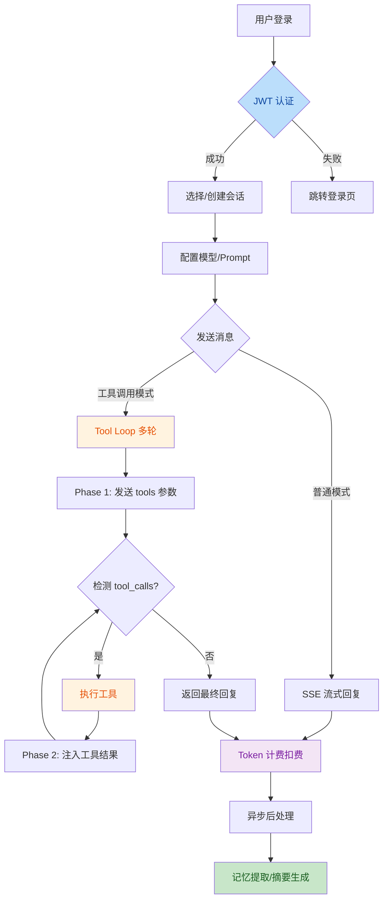
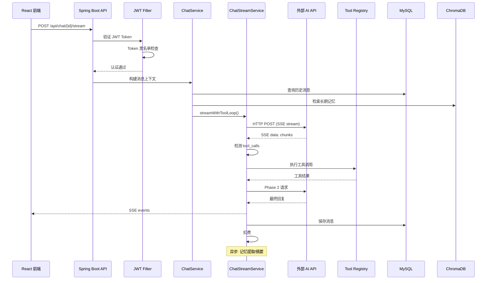

# AI Chat 项目代码审查报告

> **审查日期**：2026-07-21  
> **审查范围**：全项目代码（Java 后端 + React/TypeScript 前端）  
> **审查文件数**：约 120+ 个源文件  
> **复审状态**：已排除误报，已下调有兜底机制的问题级别

---

## 1. 审查概览

| 严重级别 | 原始 | 复审后 | 变化说明 |
|---------|------|--------|---------|
| Critical | 5 | 2 | 排除3个误报/降级 |
| Major    | 22 | 12 | 排除/降级10个 |
| Minor    | 15 | 16 | 降级流入+1个 |

### 复审排除的误报

| 原编号 | 标题 | 排除原因 |
|--------|------|---------|
| C-3.2 | JWT 密钥非线程安全 | `signingKeyBytes` 仅在 `@PostConstruct` 中赋值一次，Spring Bean 生命周期保证安全发布，JMM happens-before 确保可见性 |
| C-3.4 | Spring Boot 4.0.6 版本 | 项目时间为 2026 年，Spring Boot 4.0.6 在此时间点应为稳定版本，审查者的知识截止于 2025 年 8 月 |
| M-5.2 | triggerAsyncProcessing 命名 | `memoryService.extractAndStore()` 和 `summaryService.checkAndGenerate()` 均为 `@Async` 方法，调用后立即返回，方法确实是非阻塞的 |

### 复审降级的问题

| 原编号 | 降级 | 原因 |
|--------|------|------|
| C-3.5 | Critical→Major | 乐观锁有 3 秒超时、`user_id` 有 JPA 外键索引、仅锁定用户自身会话行、MAX=10 限制小 |
| M-4.1.9 | Major→Minor | 仅 admin 触发、detail 字段仅用于日志展示不解析、风险极低 |
| M-4.2.3 | Major→Minor | `catch(Exception)` + `logger.warn` 是优雅降级的设计决策，各组件失败不应中断聊天 |
| M-4.2.2 | Major→Minor | `CompletableFuture.cancel()` 无法中断 HTTP 请求、未取消的 Future 会被 GC、无实际资源泄露 |
| M-4.2.1 | Major→Minor | `CloseableHttpResponse` 在 try-with-resources 中，关闭时会释放 entity 的 InputStream |
| M-4.1.6 | Major→Minor | Controller 和 Service 两处校验逻辑功能等价（均要求 8+字符/大小写/数字），仅代码重复 |

---

## 2. 业务流程图



### 技术架构图



---

## 3. Critical 严重问题（2 项）

### 3.1 AES 密钥静默截断导致弱密钥

- **文件**：[AESUtil.java](file:///c:/Users/makot/Desktop/aichat/src/main/java/com/example/aichat/util/AESUtil.java#L59-L67)
- **问题**：`reloadKey` 强制将密钥裁剪为恰好 16 字节。密钥超过 16 字节时被截断前半部分（等效密钥减半），不足时尾部补 `\0`（极大弱化强度）。
- **影响**：所有通过 AES 加密的敏感数据（API Key 等）实际加密强度远低于配置的密钥强度。
- **建议**：使用 SHA-256 哈希对任意长度密钥标准化为 32 字节（AES-256），与 `JwtUtil` 保持一致。

```java
// 当前代码（有缺陷）- 截断/补零
byte[] keyBytes = key.getBytes(StandardCharsets.UTF_8);
if (keyBytes.length != 16) {
    byte[] padded = new byte[16];
    System.arraycopy(keyBytes, 0, padded, 0, Math.min(keyBytes.length, 16));
    keyBytes = padded;
}

// 建议改为 - SHA-256 标准化
MessageDigest digest = MessageDigest.getInstance("SHA-256");
byte[] keyBytes = digest.digest(key.getBytes(StandardCharsets.UTF_8));
// 使用前 16 字节（AES-128）或全部 32 字节（AES-256）
```

### 3.2 EmailService ConcurrentHashMap TOCTOU 并发问题

- **文件**：[EmailService.java](file:///c:/Users/makot/Desktop/aichat/src/main/java/com/example/aichat/service/EmailService.java#L49-L55)
- **问题**：`containsKey(email)` + `get(email)` 是两个独立操作，并发场景下两个线程可能同时通过检查和发送验证码。
- **兜底分析**：`RateLimitInterceptor` 将 `/api/auth/send-code` 限流为 1 次/分钟，大幅降低了并发窗口。但拦截器限流基于用户 key（`userId:auth-send-code`），不同用户的并发请求不互斥。代码层面仍存在 TOCTOU 风险。
- **建议**：使用 `compute` 原子方法替代分步操作：

```java
codeMap.compute(email, (k, existing) -> {
    if (existing != null && System.currentTimeMillis() - existing.createTime < 60000) {
        throw BusinessException.badRequest("请稍后再试");
    }
    return new EmailCode(generateCode());
});
```

---

## 4. Major 重要问题（12 项）

### 4.1 安全性

| # | 标题 | 文件 | 行号 | 描述 |
|---|------|------|------|------|
| 4.1.1 | API Key 前缀泄露到日志 | [ChatStreamService.java](file:///c:/Users/makot/Desktop/aichat/src/main/java/com/example/aichat/service/ChatStreamService.java#L156-L159) | 156-159 | `apiKey.substring(0, Math.min(6, apiKey.length()))` 将 Key 前6位写入 DEBUG 日志。虽生产通常不开启 DEBUG，但仍是信息泄露隐患。建议仅记录 `apiKey.length()` |
| 4.1.2 | SSE 异常消息可能泄露内部信息 | [ChatStreamService.java](file:///c:/Users/makot/Desktop/aichat/src/main/java/com/example/aichat/service/ChatStreamService.java#L247-L248) | 247-248 | `e.getMessage()` 直接透传给前端，可能暴露 API URL、连接信息等。建议生产环境返回通用消息 |
| 4.1.3 | 邮箱信息未脱敏记录 | [EmailService.java](file:///c:/Users/makot/Desktop/aichat/src/main/java/com/example/aichat/service/EmailService.java#L68) | 68, 123 | 日志中记录完整邮箱。`UserService` 已有 `maskEmail()` 脱敏方法但此处未使用 |
| 4.1.4 | 邮箱验证码暴力破解防护薄弱 | [EmailService.java](file:///c:/Users/makot/Desktop/aichat/src/main/java/com/example/aichat/service/EmailService.java#L90-L97) | 90-97 | `verifyCode` 有 5 次错误限制但 `send-code` 仅 1次/分钟限流，验证接口自身无限流。攻击者可通过重发验证码绕过限制 |
| 4.1.5 | 密码重置接口限流不对称 | [AuthController.java](file:///c:/Users/makot/Desktop/aichat/src/main/java/com/example/aichat/controller/AuthController.java#L202-L217) | 202-217 | 重置接口 5次/分钟，但发送验证码仅 1次/分钟，形成不对称防护 |
| 4.1.6 | CORS 过于宽松 | [WebConfig.java](file:///c:/Users/makot/Desktop/aichat/src/main/java/com/example/aichat/config/WebConfig.java#L31-L35) | 31-35, 91-98 | `allowedOriginPatterns("*")` + `allowedHeaders("*")`。JWT 认证下即使跨域也无法窃取 Token，但仍应限制生产环境允许的来源 |
| 4.1.7 | CSP 含 unsafe-inline | [SecurityConfig.java](file:///c:/Users/makot/Desktop/aichat/src/main/java/com/example/aichat/config/SecurityConfig.java#L67-L73) | 67-73 | `script-src 'unsafe-inline'` 削弱 XSS 防护。React SPA 常需要此配置，但有 `frame-ancestors 'none'` 作为补充防护 |

### 4.2 代码质量

| # | 标题 | 文件 | 行号 | 描述 |
|---|------|------|------|------|
| 4.2.1 | ConversationRepository 悲观锁 COUNT 查询 | [ConversationRepository.java](file:///c:/Users/makot/Desktop/aichat/src/main/java/com/example/aichat/repository/ConversationRepository.java#L28-L31) | 28-31 | `@Lock(PESSIMISTIC_WRITE)` 作用在 COUNT 查询上。有 3 秒锁超时兜底，且 `user_id` 有索引缩小锁范围，但 COUNT + FOR UPDATE 设计本身不合理 |
| 4.2.2 | UserRepository.findByRole 返回 Optional\<User\> | [UserRepository.java](file:///c:/Users/makot/Desktop/aichat/src/main/java/com/example/aichat/repository/UserRepository.java#L31) | 31 | `Optional<User> findByRole(String role)` 中 role 值不唯一（如 "USER"），多用户存在时抛 NonUniqueResultException。应改为 `List<User>` |
| 4.2.3 | PromptsHubRepository 无分页查询 | [PromptsHubRepository.java](file:///c:/Users/makot/Desktop/aichat/src/main/java/com/example/aichat/repository/PromptsHubRepository.java#L17) | 17, 28, 19 | `findAllByOrderByLikesCountDesc...`、`findByFeaturedTrue...`、`findByUserId...` 均无分页。数据量大时 OOM |
| 4.2.4 | Friendship 实体缺少唯一约束 | [Friendship.java](file:///c:/Users/makot/Desktop/aichat/src/main/java/com/example/aichat/model/Friendship.java#L8-L13) | 8-13 | `(user_id, friend_id)` 无数据库唯一约束，并发创建好友请求可能产生重复记录 |
| 4.2.5 | SSE 流异常时 reader 可能未完全释放 | [api.ts](file:///c:/Users/makot/Desktop/aichat/frontend/src/lib/api.ts#L158-L186) | 158-186 | AbortController 取消 fetch 后，如果 reader 正在 `read()` 中阻塞，可能未及时释放。`finally` 中有 `releaseLock()` 但 AbortError 可能先触发 |

---

## 5. Minor 次要问题（16 项）

| # | 标题 | 文件 | 行号 | 描述 |
|---|------|------|------|------|
| 5.1 | 验证码可能生成 "000000" | [EmailService.java](file:///c:/Users/makot/Desktop/aichat/src/main/java/com/example/aichat/service/EmailService.java#L57) | 57 | `nextInt(1000000)` 可能产生 0-99999，格式化为 "000000" 等弱验证码 |
| 5.2 | 标题截断未处理 Emoji | [ChatService.java](file:///c:/Users/makot/Desktop/aichat/src/main/java/com/example/aichat/service/ChatService.java#L242-L248) | 242-248 | `substring(0, maxLen)` 用 char 索引在 Emoji（2个 char）中间截断导致乱码 |
| 5.3 | BillingService 自注入反模式 | [BillingService.java](file:///c:/Users/makot/Desktop/aichat/src/main/java/com/example/aichat/service/BillingService.java#L44-L46) | 44-46 | `@Lazy @Autowired BillingService self` 自注入绕过 `@Transactional` 自调用限制 |
| 5.4 | FlywayConfig Bean 可能返回 null | [FlywayConfig.java](file:///c:/Users/makot/Desktop/aichat/src/main/java/com/example/aichat/config/FlywayConfig.java#L40) | 40 | `flywayEnabled=false` 时返回 null，其他 Bean 依赖可能注入失败 |
| 5.5 | 依赖注入风格不统一 | 多个 Controller | - | 混用 `@Autowired` 字段注入和构造器注入，建议统一构造器注入 |
| 5.6 | 魔法数字散布 | 多个文件 | - | 超时(30s, 300s)、重试次数(3)、充值上限(10000) 硬编码在代码中 |
| 5.7 | 消息历史全量加载再截断 | [MessageContextBuilder.java](file:///c:/Users/makot/Desktop/aichat/src/main/java/com/example/aichat/service/MessageContextBuilder.java#L201-L208) | 201-208 | `findAll` + `subList`，应使用分页查询 |
| 5.8 | ResetPassword DTO 与 RegisterRequest 密码策略不一致 | [ResetPasswordRequest.java](file:///c:/Users/makot/Desktop/aichat/src/main/java/com/example/aichat/dto/ResetPasswordRequest.java#L19) | 19 | `@Size(min = 6)` vs RegisterRequest 的 8 位（实际 Controller 中有二次校验兜底） |
| 5.9 | belongsToUser 触发 N+1 | [ConversationService.java](file:///c:/Users/makot/Desktop/aichat/src/main/java/com/example/aichat/service/ConversationService.java#L56-L59) | 56-59 | `findById` 加载整个实体 + 关联 User。建议用 `existsBy...` |
| 5.10 | PromptsHub columnDefinition 不跨库 | [PromptsHub.java](file:///c:/Users/makot/Desktop/aichat/src/main/java/com/example/aichat/model/PromptsHub.java#L58) | 58 | `columnDefinition="JSON"` 是 MySQL 特有语法，建议用 `@JdbcTypeCode(SqlTypes.JSON)` |
| 5.11 | httpclient5 版本硬编码 | [pom.xml](file:///c:/Users/makot/Desktop/aichat/pom.xml#L73-L74) | 73-74 | 硬编码绕过 Spring Boot BOM 版本管理 |
| 5.12 | 缺少 OWASP Dependency-Check | [pom.xml](file:///c:/Users/makot/Desktop/aichat/pom.xml) | - | 无自动化依赖漏洞扫描 |
| 5.13 | 密码校验逻辑重复 | [UserService.java](file:///c:/Users/makot/Desktop/aichat/src/main/java/com/example/aichat/service/UserService.java#L147-L160) + [AuthController.java](file:///c:/Users/makot/Desktop/aichat/src/main/java/com/example/aichat/controller/AuthController.java#L207) | - | Controller 和 Service 各自实现功能等价的密码校验，建议 Controller 委托 Service |
| 5.14 | 审计日志 JSON 手工拼接 | [AdminAuditLogService.java](file:///c:/Users/makot/Desktop/aichat/src/main/java/com/example/aichat/service/AdminAuditLogService.java#L94-L104) | 94-104 | `String.format("{\"amount\":\"%s\"}", ...)` 特殊字符破坏 JSON。仅 admin 触发，仅存储不解析，风险低 |
| 5.15 | CompletableFuture 竞速后未 cancel | [ChatService.java](file:///c:/Users/makot/Desktop/aichat/src/main/java/com/example/aichat/service/ChatService.java#L200-L236) | 200-236 | 双引擎竞速后未取消失败方 Future。`cancel(true)` 无法实际中断 HTTP 请求，Future 会被 GC 回收 |
| 5.16 | ModelConfig 实体混用 Bean Validation | [ModelConfig.java](file:///c:/Users/makot/Desktop/aichat/src/main/java/com/example/aichat/model/ModelConfig.java#L30-L47) | 30-47 | `@NotBlank` 等在 JPA persist 时不自动触发，应移到 DTO 层 |

---

## 6. 优点

1. **SSRF 防护**：`NetworkUtils.validateExternalUrl` 覆盖内网、回环、保留地址；`AnalyzeImageTool` 额外做了域名白名单
2. **API Key 加密存储**：AES-GCM 加密 + 明文数据迁移支持
3. **Token 黑名单双层保障**：Caffeine 缓存 + MySQL 持久化
4. **审计日志完善**：异步写入 + 90 天自动清理
5. **密码 BCrypt 加密**：符合行业标准
6. **HTTP 安全头全面**：CSP、HSTS、X-Frame-Options、X-Content-Type-Options
7. **乐观锁扣费重试**：`BillingService.deductTokens` 乐观锁 + 3 次重试
8. **速率限制完善**：17 条规则覆盖所有敏感端点
9. **优雅降级设计**：`MessageContextBuilder` 中记忆、摘要、知识库等模块失败不影响聊天主流程
10. **前端错误边界**：ErrorBoundary 防止 UI 崩溃

---

## 7. 修复优先级

### 第一优先级（立即修复）
1. **AES 密钥截断** (3.1) — 影响所有加密数据的安全性
2. **EmailService TOCTOU** (3.2) — 验证码绕过风险
3. **SSE 异常消息泄露** (4.1.2) — 信息泄露到前端

### 第二优先级（本周修复）
4. API Key 前缀泄露 (4.1.1)
5. 邮箱日志脱敏 (4.1.3)
6. CORS 限制 (4.1.6)
7. 验证码暴力破解防护 (4.1.4)

### 第三优先级（计划修复）
8. ConversationRepository 悲观锁 COUNT (4.2.1)
9. findByRole NonUniqueResultException (4.2.2)
10. PromptsHub 分页 (4.2.3)
11. 其他 Minor 级问题

---

*本报告由 TRAE-code-review 自动生成，经人工复审排除误报*
