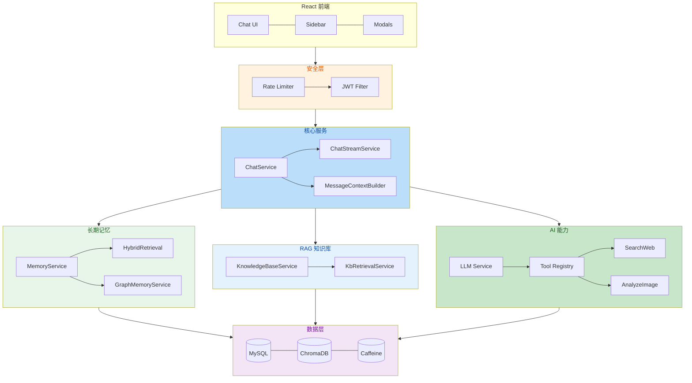

[English](README_EN.md) | 简体中文

---

# HanaChat

**让 AI 记住你、理解你、代替你干活。** 一个自带仿人类长期记忆和 RAG 知识库的多模型 AI 聊天平台，支持 AI 自主调用外部工具，用 Spring Boot 4 + React 19 构建。

---

## 核心特点

- **仿人类长期记忆** — 四级衰减 + 懒衰减机制，AI 像人一样"记住重要的事、遗忘无关的细节"。记忆自动提取、按需回溯，并通过知识图谱关联实体关系。
- **AI 自主工具调用** — 基于 Function Calling 协议，AI 可自主决策联网搜索或分析图片，支持多轮 Tool Loop 编排和双引擎并发竞速。
- **RAG 知识库** — 文档上传 → 自动分块 → 混合检索（向量 + BM25）→ Cross-Encoder Rerank 精排，让 AI 基于你的私有知识回答。
- **提示词级记忆隔离** — 记忆按 System Prompt 自动分组，切换角色自动切换记忆空间，零配置实现多角色管理。

---

## 功能概览

| 模块 | 说明 |
|------|------|
| 智能对话 | SSE 流式输出、多模型动态切换、中途停止、上下文保持 |
| 工具调用 | AI 自主调用联网搜索、图片分析，多轮 Tool Loop 自动编排 |
| 长期记忆 | 仿人类四级衰减、懒衰减、语义回溯、知识图谱实体消歧 |
| RAG 知识库 | 文档上传 → 混合检索 → Rerank 精排，多格式解析 |
| 好友系统 | PID 搜索、好友申请/私聊、未读消息红点 |
| 计费系统 | 分模型计价、余额预扣、乐观锁防并发、每日签到 |
| 管理后台 | 用户管理、模型配置、消费统计、审计日志 |

---

## 快速开始

**前置条件：** JDK 17+ / Docker & Docker Compose / Node.js 18+

```bash
# 1. 配置环境变量（.env）
DB_PASSWORD=your_db_password
JWT_SECRET=your_jwt_secret_at_least_32_chars
ENCRYPTION_KEY=your-16-char-aes-key
SILICONFLOW_API_KEY=sk-xxxxx
MEMORY_LLM_API_KEY=sk-xxxxx

# 2. 一键启动
docker compose up -d

# 3. 前端开发（可选）
cd frontend && npm install && npm run dev
```

启动后访问 `http://localhost:8080`。

---

## 技术栈

| 分类 | 技术 |
|------|------|
| 后端 | Spring Boot 4 + JDK 17 + Spring Security + JWT |
| 数据层 | MySQL 8.0 + ChromaDB + Caffeine + Flyway |
| AI 能力 | OpenAI Function Calling / SSE 流式 / 硅基流动 Embedding / bge-reranker-v2-m3 |
| 检索 | 混合检索（向量 + BM25）+ RRF 融合 + Cross-Encoder Rerank |
| 前端 | React 19 + TypeScript + Tailwind CSS + shadcn/ui |
| 部署 | Docker Compose (App + MySQL + ChromaDB) |

---

## 安全概览

- **JWT 无状态认证** + Caffeine/MySQL 双层 Token 黑名单，支持"记住我"
- **AES-128-GCM 加密**存储所有 API Key，敏感配置通过环境变量注入
- **21 条精细化限流规则**覆盖登录、聊天、管理等接口，基于 Caffeine + AtomicInteger
- **乐观锁计费**（`@Version` + 重试）防止并发重复扣费，余额预扣 + 失败释放
- **SSRF 防护**、图片上传白名单、管理操作全量审计日志

---

## 架构概览


