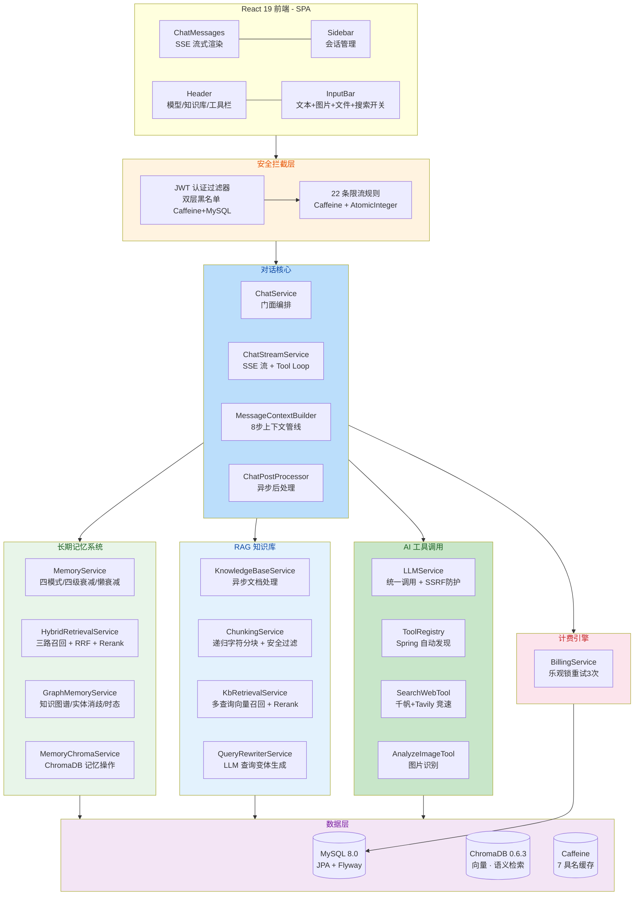

[English](README_EN.md) | 简体中文

---
文档由ai依据项目代码生成，可能会有偏差及夸大成分，请理性看待
---

# HanaChat

**让 AI 记住你、理解你。**

一个自带仿人类长期记忆和 RAG 知识库的多模型 AI 聊天平台，支持 AI 自主调用外部工具（Function Calling），基于 Spring Boot 4 + React 19 构建。

> **在线体验：**[www.man8out.xyz](https://www.man8out.xyz)

---

## 项目核心特色

HanaChat 不是又一个 AI 聊天套壳——它在四个维度上做出了有区分度的设计：

### 🧠 长期记忆——记住你的一切，忘记无关的细节

模拟了人类记忆的完整生命周期：**自动提取 → 分级存储 → 阶梯衰减 → 语义回溯 → 自然遗忘**。AI 在每轮对话后自动从回复中提取关键事实——你的偏好、决定、个人信息——并存入 ChromaDB 向量库。记忆会随着时间阶梯衰减：3 天内的保持完整，3-7 天压缩为概要，14 天后自动遗忘。但你随时提起，它能瞬间从数千条记忆中找回相关片段。

**与其他框架的关键差异**：CrewAI / Mem0 / LangChain 等主流框架要么不支持遗忘衰减，要么依赖定时任务轮询。**懒衰减**机制——读取时才检查时间、执行衰减，零空闲开销。

### 🔧 AI 自主工具调用——AI 自己决定何时"上网查"、"看图片"

基于 OpenAI Function Calling 协议的完整工具调用框架。AI 不只是被动回答问题——它能**自主决策**何时发起联网搜索获取实时信息，或分析用户上传的图片内容。双引擎竞速机制将百度千帆和 Tavily 同时调用，谁先返回就用谁的结果。Tool Loop 编排让 AI 调用工具获取外部信息后，基于结果生成回复（限制为 1 轮工具调用以确保响应速度）。

### 📚 RAG 知识库——让 AI 基于你的私有知识回答

完整的多格式文档 → 智能分块 → 向量化 → 语义检索 → 精排流水线。查询时将用户问题先做查询重写（生成 2-3 个检索变体），然后通过多查询并行向量召回（ChromaDB，bge-large-zh-v1.5），用 RRF 融合多变体结果，再由 Cross-Encoder 精排模型（bge-reranker-v2-m3）逐条打分，最终 Top-5 注入上下文。为节省性能，知识库已移除 BM25 关键词检索，仅依赖向量语义召回 + Rerank 精排保障精度。知识库级别的分块参数和 Prompt 模板均可独立配置。

### 🎭 提示词级记忆隔离——多角色场景下记忆零污染

每个 System Prompt（角色设定）自动拥有独立的记忆空间和对话空间。切换到"编程导师"时，只有与编程相关的记忆和对话被加载；切换到"健身教练"时亦然。记忆、会话、消息、摘要、知识图谱扩展全部按 prompt 隔离。无需手动切换记忆库——零配置实现真正的多角色管理。

---

## 功能矩阵

### 聊天引擎

| 能力 | 说明 |
|------|------|
| **SSE 流式输出** | 逐 token 实时推送，前端打字机效果渲染，支持随时停止 |
| **多模型动态切换** | 支持任意 OpenAI 兼容协议的模型，对话中实时切换，无需刷新 |
| **上下文保持** | 会话历史持久化存储，最多 30 轮历史注入，刷新页面不丢失 |
| **多模态输入** | 支持文字 + 图片 + 文件混合输入，图片自动调用视觉模型识别 |
| **上下文注入管线** | 系统规则 → 提示词 → 长期记忆 → 摘要 → 知识库 → 历史 → 图片/文件 → 当前消息，8 步管线严格有序 |

### 仿人类长期记忆

记忆系统的核心是**四级衰减 + 懒衰减**模型，模拟人类"记住重要的、遗忘无关的"：

| 阶段 | 时间（未访问） | 状态 | 处理方式 |
|------|---------------|------|----------|
| 清晰期 | 0-3 天 | `FULL` | 保留原文，每次对话主动注入上下文 |
| 模糊期 | 3-7 天 | `BRIEF` | LLM 智能压缩至约 200 字摘要 |
| 轮廓期 | 7-14 天 | `TITLE` | LLM 压缩至约 50 字概要，不主动注入 |
| 遗忘 | 14+ 天 | 删除 | 从 ChromaDB + MySQL 中彻底清除 |

**五种操作模式**：

1. **自动提取**：每轮对话结束后，异步调用 LLM 从 AI 回复中提取关键事实，去重后双写 ChromaDB + MySQL
2. **默认注入**：每次对话自动注入最近 20 条清晰/模糊期记忆，含知识图谱 1 跳扩展
3. **语义回溯**：用户提及相关内容时，三路混合检索全库记忆，命中的恢复衰减状态
4. **懒衰减**：读取记忆时实时检查时间戳，按阶梯规则执行压缩或删除——**无定时任务，零空闲开销**
5. **手动管理**：支持手动添加/编辑/启用/禁用/删除记忆，手动记忆永不衰减

**安全防护**：记忆内容在提取和注入两侧均做 Prompt Injection 正则过滤，防止恶意记忆劫持 AI 行为。

### 知识图谱

记忆不是孤立碎片，HanaChat 自动构建实体关系图：

- **三元组提取**：从每条记忆中提取（主语, 谓词, 宾语）三元组，LLM 标注实体类型
- **实体消歧**：自动识别同人异名（如"张三"与"张老师"），LLM 判定后合并
- **时态管理**：每条记忆带 `valid_from` / `valid_until` 时间范围，新事实取代旧事实时自动标记 `SUPERSEDED` + 级联失效图谱关系
- **图扩展检索**：语义搜索找到种子记忆后，沿实体关系做 1 跳扩展，邻接记忆以 0.5 权重参与排序
- **反向关系**：6 对高频谓词（如"工作于"↔"拥有员工"）自动追加反向边，图遍历方向完整

### 提示词级隔离

传统方案中，多个 AI 角色的记忆和对话混在一起，造成角色混淆。HanaChat 的四层隔离方案：

| 层级 | 隔离方式 |
|------|----------|
| 记忆 | `memory_items.prompt_id = NULL`（共享）或 `= X`（角色 X 专属） |
| 会话 | `conversations.prompt_id` 关联角色，切换自动隔离 |
| 消息 | `chat_messages.prompt_id`，历史消息查询按 prompt 过滤 |
| 知识图谱 | 实体和关系用户级共享，"反查记忆"时按 prompt_id 过滤 |

### 对话摘要

解决长对话上下文溢出问题，采用增量摘要策略：

- 每 20 条消息触发（可配置）
- 保留最近 10 条完整消息，其余压缩为结构化摘要
- **角色化摘要**：读取 Prompt 名称，让 LLM 以角色视角和语气生成摘要，不稀释角色风格
- 增量合并：已有摘要时追加而非全量重生成

### AI 自主工具调用

基于 OpenAI Function Calling 协议的完整插件式框架：

**核心架构**
- `ToolRegistry`：Spring 自动发现所有 `ToolHandler` 实现，按需激活工具
- `ToolCallAccumulator`：处理流式 SSE 中 tool_calls 的 delta 分片累积（支持并行调用），完整兼容 OpenAI 流式协议
- 新增工具只需实现 `ToolHandler` 接口并标注 `@Component`

**Tool Loop**
```
用户消息 → LLM（带 tools）→ finish_reason="tool_calls"
→ 执行工具（并发）→ 注入结果 → LLM（不带 tools）
→ finish_reason="stop" → 生成最终回复
```
- 限制为 1 轮工具调用以确保回复速度，单工具超时 60s，全流程超时 300s

**已实现工具**

| 工具 | 功能 | 实现 |
|------|------|------|
| `search_web` | 联网搜索 | 百度千帆 + Tavily 双引擎并发竞速，5 分钟 Caffeine 缓存 |
| `analyze_image` | 图片分析 | 调用多模态 LLM，SSRF URL 白名单防护 |

**角色沉浸保持**：工具执行后在结果中注入角色化指令（"请用你扮演的角色语气重述以下信息"），避免工具调用"破功"。

### RAG 知识库

完整的文档 → AI 回答流水线：

**文档处理**
- 支持 TXT 格式，解析器采用插件式架构（实现 `DocumentParser` 接口即可扩展）
- 递归字符分块：`\n\n` → `\n` → `。` → `；` → `，` → 硬切，带重叠
- 分块参数（size/overlap）可配置，最大 500 块/文档
- 异步处理，线程池隔离，上传秒返回
- 限制：单文件 20MB / 单知识库 200 篇 / 单用户 1000 篇 / 500MB

**检索流水线**
```
查询重写（2-3 变体）
  → 多查询并行向量召回（ChromaDB，bge-large-zh-v1.5）
  → RRF 融合多变体结果
  → Cross-Encoder 精排（bge-reranker-v2-m3）
  → Top-5 注入上下文
```

**知识库级可配置**
- Chunk Size / Chunk Overlap
- Prompt 模板（`{context}` / `{query}` 占位符）
- 查询重写开关

**安全**：分块阶段 Prompt Injection 过滤、文件 MIME 类型校验、路径穿越防护。

### 计费系统

| 能力 | 实现细节 |
|------|----------|
| **分模型计价** | 输入/输出分别定价，单位「每 1000 tokens」 |
| **余额预扣** | 对话前按 2 倍估算预扣（安全系数），对话后实扣 + 释放差额 |
| **乐观锁重试** | `@Version` + 最多 3 次重试，`REQUIRES_NEW` 事务隔离 |
| **崩溃恢复** | 应用重启时自动回收 `reserved_balance > 0` 的预扣余额 |
| **充值渠道** | 管理员充值 + 赞助上传（人工审核下发） |
| **每日签到** | 固定奖励，按日期去重 |
| **缓存策略** | 余额缓存 TTL 30s（高频更新），消费记录 TTL 2min |

### 好友与私聊

- 唯一 PID 搜索添加好友
- 好友申请 / 接受 / 拒绝管理
- 好友间一对一私聊，已读/未读状态追踪
- 红点未读消息提醒

### 提示词社区

- 用户自定义提示词，支持上传分享到社区
- 社区提示词浏览、搜索、收藏、一键下载到个人库
- 评分评论系统
- 管理员审核机制

### 通知系统

- 系统通知推送，未读红点角标
- 单条/批量已读、删除

---


## 安全体系

### 认证与授权

- **JWT 无状态认证**：Spring Security + 自定义 JwtAuthenticationFilter，HMAC-SHA256 签名
- **双层 Token 黑名单**：Caffeine 内存缓存（毫秒级）+ MySQL 持久化（重启不丢失），SHA-256 哈希存储不落原文
- **"记住我"**：前端双 Storage 策略（默认 sessionStorage 关闭即失效，勾选后 localStorage 7 天有效）
- **角色分离**：USER / ADMIN 双角色，管理后台独立认证，`/api/admin/**` 强制 `ROLE_ADMIN`
- **登录防护**：5 次/分钟限流、防用户枚举（统一错误提示）、8 位密码强度强制校验

### 数据加密

- **AES-128-GCM 认证加密**：所有第三方 API Key 以 `ENC:` 前缀加密存储，密钥通过环境变量注入
- **自动迁移**：应用启动时检测并迁移明文/旧格式 Key
- **BCrypt**：用户密码哈希
- **环境变量强制**：JWT 密钥、AES 密钥、管理员密码等敏感配置必须通过环境变量注入，`docker-compose.yml` 使用 `:?` 语法强制校验

### API 防护

- **22 条精细化限流规则**：区分登录（5 次/min）、聊天（30 次/min）、验证码（1 次/min）、管理后台（3 次/min）等接口
- **SSRF 防护**：LLM API 调用前校验 URL 非内网，图片工具白名单校验存储域名
- **CORS 白名单**：通过环境变量 `ALLOWED_ORIGINS` 配置，生产环境严格限制
- **CSP 安全响应头**：`frame-ancestors 'none'` + HSTS + `X-Content-Type-Options: nosniff`
- **路径穿越防护**：文件上传 UUID 重命名 + 正则过滤 `..`

### 计费安全

- **乐观锁**：`@Version` + 3 次重试防止并发重复扣费
- **余额预扣**：先锁后扣，异常自动释放
- **崩溃恢复**：启动时扫描 `reserved_balance > 0` 的用户并归还

### 审计日志

- 19 种管理操作全覆盖（用户管理、赞助审核、模型配置、系统规则等）
- `@Async` + `REQUIRES_NEW` 事务，不阻塞主业务
- 记录操作人、目标、详情（JSON）、IP 地址，不可删除

### 已知良好实践

代码中 **零 SQL 注入、零 OS 命令注入、零 XXE、零不安全反序列化、零 XSS、零 CSRF、零开放重定向、零 eval/exec**。JPQL 全参数化绑定，文件上传 MIME 白名单校验，Docker 容器非 root 用户运行。

---

## 技术栈

| 分类 | 技术 | 用途 |
|------|------|------|
| **后端框架** | Spring Boot 4.0.6 · JDK 17 · Maven | 全栈 Java 后端 |
| **安全** | Spring Security · JWT (jjwt 0.12.6) · BCrypt · AES-128-GCM | 认证、授权、加密 |
| **数据层** | MySQL 8.0 · Spring Data JPA · Flyway | 关系型数据 + 版本化迁移 |
| **向量数据库** | ChromaDB 0.6.3 (REST API) | 语义向量存储与检索 |
| **缓存** | Caffeine | 7 个具名缓存，按业务定制 TTL |
| **AI 协议** | OpenAI 兼容 API | Function Calling / SSE 流式 |
| **嵌入模型** | 硅基流动 BAAI/bge-large-zh-v1.5 | 1024 维中文语义向量 |
| **精排模型** | BAAI/bge-reranker-v2-m3 (硅基流动) | Cross-Encoder 重排序 |
| **搜索** | 百度千帆 AI Search · Tavily Search API | 双引擎竞速联网搜索 |
| **HTTP 客户端** | Apache HttpClient 5 | 连接池 50 + 超时控制 |
| **前端框架** | React 19 · TypeScript 6.0 · Vite 8 | 现代 SPA 前端工程 |
| **UI** | Tailwind CSS 3 · shadcn/ui (Radix UI) · Lucide Icons | 原子化 CSS + 无头组件 + 图标 |
| **动画** | Motion (Framer Motion) | React 声明式动画 |
| **部署** | Docker · Docker Compose | 3 服务（app + MySQL + ChromaDB）编排 |
| **存储** | AWS SDK S3 (兼容) · 本地文件系统 | 图片/文件/知识库文档存储 |

---

## 架构概览

### 整体架构



### 一次对话请求的完整生命周期

```
1. 客户端发起 [React SPA]
   └─ 用户输入文字/图片/文件，点击发送
   └─ SSE 连接建立 (apiStream → ReadableStream.getReader())

2. 安全拦截 [Security Layer]
   └─ JWT 认证过滤器 → 解析 userId + role
   └─ 22 条规则命中匹配 → 窗口计数 + X-RateLimit-* 响应头
   └─ 计费预扣 → balance → reserved_balance (2x 安全系数)

3. 上下文组装 [MessageContextBuilder，严格有序]
   ├─ ① 系统规则（全局安全约束）
   ├─ ② 自定义提示词（角色设定 System Prompt）
   ├─ ③ 长期记忆注入（最近 20 条 + 知识图谱 1 跳扩展，按 prompt_id 隔离）
   ├─ ④ 对话摘要（增量 LLM 生成，角色化语气）
   ├─ ⑤ 知识库检索（查询重写 → 多查询并行向量召回 → Rerank → Top-5）
   ├─ ⑥ 历史消息（最近 30 轮，按 prompt_id 过滤）
   ├─ ⑦ 图片/文件引用
   └─ ⑧ 当前用户消息

4. LLM 调用 [ChatStreamService]
   └─ 构建 OpenAI 兼容请求体 (model, messages, tools, stream: true)
   └─ 在 LLMService 中 SSRF 校验 API URL
   └─ HttpClient5 发送 POST，读取 SSE 原始流

5. 工具调用（如果 AI 决定使用工具）[Tool Loop]
   ├─ Phase 1: 检测 delta.tool_calls → ToolCallAccumulator 分片累积
   ├─ finish_reason="tool_calls" → 执行工具
   │   ├─ search_web: 千帆 + Tavily 并发 → anyOf 竞速 → 2000 字截断
   │   └─ analyze_image: SSRF URL 白名单 → 多模态 LLM
   ├─ 注入 tool 结果 + 角色化指令到 messages
   └─ Phase 2: 调用 LLM（不带 tools），生成最终回复（限制 1 轮）

6. 流式输出 [SSE Push]
   └─ 逐行解析 data: JSON → 提取 content → SseEmitter.send()
   └─ 前端 AsyncGenerator 逐 chunk 更新 UI（打字机效果）
   └─ 用户可随时 handleStop() → AbortController.abort()

7. 后处理 [ChatPostProcessor @Async]
   ├─ 记忆提取: LLM 分析用户消息 + AI 回复 → 去重 → 双写 ChromaDB + MySQL
   │   └─ 知识图谱: 提取三元组 → 实体消歧 → 时态冲突检测 → 关系建边
   ├─ 摘要更新: 检查是否触发阈值 → 增量生成/合并
   └─ 计费结算: 按实际 token 用量扣除 → 释放预扣差额

8. 持久化
   └─ 消息、记忆、Token 用量记录写入 MySQL
   └─ 前端用数据库 ID 替换临时 ID
   └─ 刷新会话列表（标题自动生成）
```

---

## 快速开始

### 硬件要求

- **最低配置**：2 核 CPU + 4GB 内存（可承载日均 200-500 用户）
- **推荐配置**：4 核 8GB 以上

### 前置条件

- JDK 17+
- Docker & Docker Compose
- Node.js 18+（仅前端开发）

### 1. 配置环境

复制 `.env.example` 为 `.env`：

```bash
#========== 必填 ==========
DB_PASSWORD=your_db_password
JWT_SECRET=your_secret_at_least_32_characters
ENCRYPTION_KEY=your_16_char_key
ADMIN_USERNAME=admin
ADMIN_PASSWORD=your_admin_password
ADMIN_EMAIL=admin@example.com

#========== AI 服务 ==========
# 硅基流动 — Embedding + Rerank
SILICONFLOW_API_KEY=sk-xxxxxxxxxxxxx

# 百度千帆 — 联网搜索（主引擎）
QIANFAN_API_KEY=your_qianfan_key

# Tavily — 联网搜索（竞速引擎）
TAVILY_API_KEY=tvly-xxxxxxxxxxxxx

# 记忆提取专用 LLM（推荐 DeepSeek）
MEMORY_LLM_API_KEY=sk-xxxxxxxxxxxxx
MEMORY_LLM_API_URL=https://api.deepseek.com/v1/chat/completions
MEMORY_LLM_MODEL_NAME=deepseek-chat

#========== 可选 ==========
# S3 存储（图片/文件）
S3_ACCESS_KEY=your_access_key
S3_SECRET_KEY=your_secret_key
S3_URL_PREFIX=https://your-s3-endpoint.com

# 邮件服务（注册验证码）
MAIL_USERNAME=your_email@example.com
MAIL_PASSWORD=your_smtp_password

# CORS（生产环境设置实际域名）
ALLOWED_ORIGINS=https://your-domain.com,http://localhost:5173
```

### 2. 一键启动

```bash
# 构建镜像并启动全部服务
docker compose up -d --build
```

启动后访问 `http://localhost:8080`。三个容器的资源分配：

| 服务 | 镜像 | 端口 | 内存限制 |
|------|------|------|----------|
| MySQL 8.0 | mysql:8.0 | 3307:3306 | 1024MB |
| ChromaDB 0.6.3 | chromadb/chroma:0.6.3 | 8000:8000 | 384MB |
| HanaChat App | 本地构建 (Dockerfile) | 8080:8080 | 1536MB |

### 3. 前端开发

```bash
cd frontend
npm install
npm run dev
```

开发服务器运行在 `http://localhost:5173`，通过 Vite 代理转发 API 请求到 `localhost:8080`。

### 4. 生产部署检查清单

- [ ] 修改 `ALLOWED_ORIGINS` 为实际域名
- [ ] 确认 `DB_PASSWORD` / `JWT_SECRET` / `ENCRYPTION_KEY` 使用强随机值
- [ ] 移除 MySQL 对外端口暴露（注释 `docker-compose.yml` 中 `3307:3306`）
- [ ] 配置 SMTP 邮件服务
- [ ] 在模型管理后台添加对话模型并配置定价
- [ ] 确认 Cloudflare 未开启 Bot Fight Mode（会拦截 SSE 流）

---

## 项目结构

```
aichat/
├── src/main/java/com/example/aichat/
│   ├── AichatApplication.java           # 入口（管理员初始化 + 余额回收 + Key 迁移）
│   ├── config/                           # 配置层
│   │   ├── SecurityConfig.java          # Spring Security 7（JWT + CSP + HSTS + 静态资源适配）
│   │   ├── JwtAuthenticationFilter.java # JWT 解析 → userId + role → SecurityContext
│   │   ├── RateLimitInterceptor.java    # 22 条精细化限流（Caffeine + AtomicInteger 窗口）
│   │   ├── TokenBlacklist.java          # 双层黑名单（Caffeine 缓存 + MySQL 持久化）
│   │   ├── GlobalExceptionHandler.java  # 统一异常处理（无内部信息泄露）
│   │   ├── ApiKeyEncryptor.java         # JPA Converter — API Key AES-128-GCM 字段级加密
│   │   ├── WebConfig.java               # CORS 白名单 + 8 个上传目录静态映射
│   │   ├── AppConfig.java               # HttpClient5 连接池 + 三种线程池
│   │   ├── CacheConfig.java             # 7 个 Caffeine 具名缓存
│   │   ├── FlywayConfig.java            # 数据库版本迁移（Spring Boot 4 手动接管）
│   │   ├── ChromaDBLauncher.java        # 自动启停子进程（15s 就绪等待）
│   │   └── props/                       # 14 个 @ConfigurationProperties（启动时强制校验）
│   ├── controller/                       # 控制器层（15 个前台 + 11 个管理后台）
│   │   ├── ChatController.java          # SSE 流式 + 非流式双接口
│   │   ├── AuthController.java          # 注册/登录/密码重置（TOCTOU 验证码）
│   │   ├── KnowledgeBaseController.java # KB CRUD + 文档上传/重新索引
│   │   ├── MemoryController.java        # 记忆 CRUD + 搜索 + 启用/禁用 + 清空
│   │   ├── BillingController.java       # 余额/用量/签到/赞助上传
│   │   ├── FriendController.java        # PID 搜索 + 好友申请/私聊
│   │   ├── PromptsHubController.java    # 提示词社区（上传/下载/评分）
│   │   ├── NotificationController.java  # 通知列表/已读/删除
│   │   ├── FileController.java          # 通用文件上传（S3）
│   │   └── admin/                       # 管理后台（仪表盘/用户/模型/消费/审计/会话/规则）
│   ├── service/                          # 服务层（30+ 服务）
│   │   ├── ChatService.java             # 门面编排：验证 → 上下文 → 计费 → 分发 → 后处理
│   │   ├── ChatStreamService.java       # SSE 流式核心（180+ 行 Tool Loop 实现）
│   │   ├── ChatPostProcessor.java       # 异步编排：记忆提取 + 摘要生成
│   │   ├── MessageContextBuilder.java   # 8 步上下文管线（200+ 行有序组装）
│   │   ├── MemoryService.java           # 四模式记忆（提取/注入/回溯/衰减）
│   │   ├── GraphMemoryService.java      # 知识图谱：实体消歧 + 时态冲突 + 图扩展
│   │   ├── HybridRetrievalService.java  # 三路召回（向量 + 图谱）→ RRF → Rerank
│   │   ├── KnowledgeBaseService.java    # KB CRUD + 异步文档处理 + 配额检查
│   │   ├── KbRetrievalService.java      # 多查询并行 → RRF 融合 → Rerank 精排
│   │   ├── ChunkingService.java         # 递归字符分块 + Prompt Injection 过滤
│   │   ├── QueryRewriterService.java    # LLM 查询重写（2-3 变体）
│   │   ├── LLMService.java              # 统一 LLM 调用（SSRF 防护 + Token 估算）
│   │   ├── BillingService.java          # 乐观锁计费（@Version + 3 次重试 + 自注入）
│   │   ├── SummaryService.java          # 增量摘要 + 角色化语气
│   │   ├── SiliconFlowEmbeddingService.java # 1024 维向量化
│   │   ├── SiliconFlowRerankService.java    # Cross-Encoder 精排 + 容错降级
│   │   ├── TavilySearchService.java     # Tavily 搜索 API 封装
│   │   ├── SearchService.java           # 百度千帆搜索 API 封装
│   │   ├── ChromaDBService.java         # Collection `kb_{id}` + 批操作
│   │   ├── MemoryChromaService.java     # Collection `mem_{userId}` + 记忆操作
│   │   ├── BaseChromaDBService.java     # ChromaDB V2 REST API 抽象基类
│   │   ├── EntityRetrievalService.java  # 知识图谱实体检索
│   │   ├── parser/                      # 文档解析器（TxtParser + DocumentParser 接口）
│   │   └── tool/                        # 工具调用框架（8 个文件）
│   │       ├── ToolRegistry.java        # Spring 自动发现 + 动态激活
│   │       ├── ToolCallAccumulator.java # 流式 delta 分片累积（支持并行调用）
│   │       ├── SearchWebTool.java       # 千帆 + Tavily 竞速 + Caffeine 缓存
│   │       └── AnalyzeImageTool.java    # SSRF 白名单 + 多模态识别
│   ├── model/                            # JPA 实体（26 个）
│   ├── repository/                       # Spring Data JPA 仓库（27 个）
│   ├── dto/                              # 数据传输对象（20 个）
│   └── util/                             # 工具类（JwtUtil · AESUtil · NetworkUtils）
├── src/main/resources/
│   ├── application.properties           # 公共业务参数（记忆衰减/摘要/RAG/嵌入模型）
│   ├── application-dev.properties       # 本地开发（127.0.0.1）
│   ├── application-prod.properties      # 生产环境（Docker 内部地址）
│   └── db/migration/                    # 16 个 Flyway 迁移脚本（V1-V15）
├── frontend/                             # React 19 前端
│   ├── src/
│   │   ├── App.tsx                      # 唯一页面级组件（15+ useState，全部 Hook 编排）
│   │   ├── main.tsx                     # 入口（ErrorBoundary → ToastProvider → AuthProvider）
│   │   ├── index.css                    # Tailwind CSS 入口
│   │   ├── components/
│   │   │   ├── chat/                    # ChatMessages（智能滚动）· ConversationList（两步删除）
│   │   │   ├── layout/                  # Header（三段布局）· InputBar（自适应高度+发送/停止切换）
│   │   │   ├── modals/                  # 8 个模态框（资料/钱包/提示词/消息/好友/KB/记忆/新建会话）
│   │   │   └── shared/                  # BrandIcon · KBSelector · ModelSelector · WebSearchToggle
│   │   └── lib/
│   │       ├── api.ts                   # HTTP 层（SSE AsyncGenerator + 401 自动跳转）
│   │       ├── auth.tsx                 # AuthContext（React Context 认证状态管理）
│   │       ├── services.ts              # API 接口层（40+ 端点 + TypeScript 类型定义）
│   │       ├── toast.tsx                # Toast 通知系统（3 类型 · 5 条上限 · 3.5s 自动消失）
│   │       └── hooks/                   # 8 个自定义 Hook
│   │           ├── useChat.ts           # SSE 流式生命周期（AbortController + 防重入锁）
│   │           ├── useConversations.ts  # 会话管理（序列号解决竞态条件）
│   │           ├── useBilling.ts        # 余额/用量/签到
│   │           ├── useNotifications.ts  # 通知列表/未读计数（乐观更新）
│   │           ├── useFriends.ts        # 好友系统
│   │           ├── useImageUpload.ts    # 图片上传（useRef 避免不必要渲染）
│   │           └── useFileUpload.ts     # 文件上传
│   ├── package.json
│   └── vite.config.ts
├── docker-compose.yml                    # 3 服务编排（健康检查 + 6 Volume + 资源限制）
├── Dockerfile                            # 多阶段构建（eclipse-temurin:17-jre-alpine · 非 root）
├── entrypoint.sh                         # 容器启动脚本
├── .env.example                          # 环境变量模板（18 个变量）
├── pom.xml                               # Maven 构建（Spring Boot 4.0.6 + 20+ 依赖）
└── PlansDocs/                            # 项目文档（1.0 → 6.0，50+ 份设计/分析/审查报告）
```

---

## License

MIT
