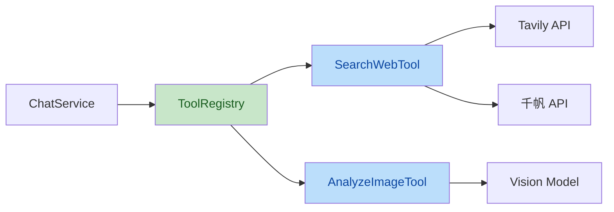
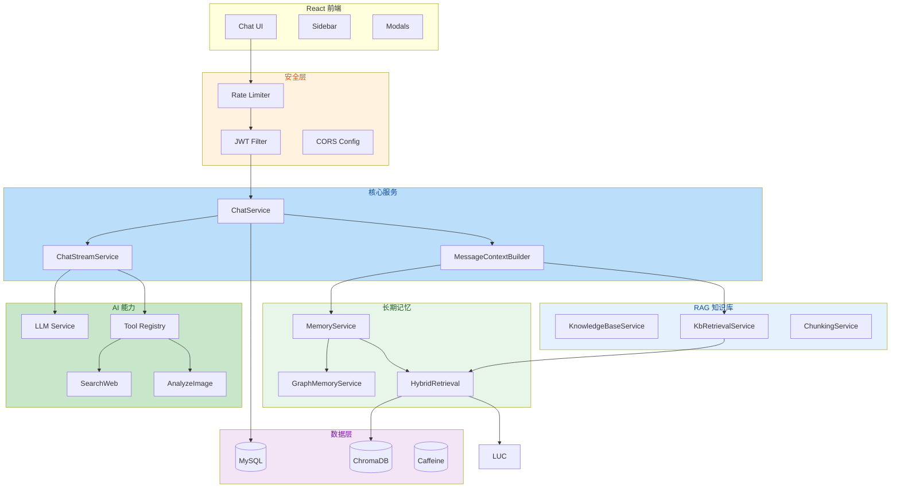

[English](README_EN.md) | 简体中文

---

# HanaChat

基于 Spring Boot 4 + React 19 的多模型 AI 聊天平台，集成工具调用、RAG 知识库、仿人类长期记忆、知识图谱、好友系统、Token 计费及管理后台。

---

## 功能概览

| 模块 | 功能 |
|------|------|
| 智能对话 | SSE 流式输出、多模型动态切换、中途停止、上下文保持 |
| 工具调用 | AI 自主调用联网搜索、图片分析，多轮 Tool Loop 自动编排 |
| 提示词系统 | 自定义 System Prompt、提示词社区广场、精选/点赞 |
| RAG 知识库 | TXT/MD 文档上传 → 自动分块 → 向量检索 → Rerank 精排 |
| 长期记忆 | 仿人类记忆模型：四级衰减、懒衰减、语义回溯、知识图谱 |
| 好友系统 | PID 精准搜索、好友申请/私聊、未读消息红点 |
| 计费系统 | Token 分模型计价、余额预扣、赞助充值、每日签到 |
| 管理后台 | 用户管理、模型配置、消费统计、赞助审核、审计日志 |

---

## 技术亮点

### 1. 工具调用（Tool Calling）

基于 OpenAI Function Calling 协议的自定义工具调用框架，AI 可自主决策使用联网搜索或图片分析。

```
用户提问 → LLM 返回 tool_calls → ToolRegistry 执行 → 结果注入 Phase 2 → LLM 生成最终回复
```

**架构设计：**



- **插件化注册**：`ToolHandler` 接口 + Spring 自动发现，新增工具只需实现接口
- **多轮编排**：支持 MAX_ROUNDS=3 轮 Tool Loop，每轮解析 tool_calls delta 并执行
- **并行执行**：同轮多个工具通过 `CompletableFuture` 并发调用
- **双层降级**：不支持工具调用的模型自动走预注入搜索结果的降级路径

### 2. 仿人类长期记忆系统

#### 四种记忆操作模式

| 模式 | 触发时机 | 说明 |
|------|---------|------|
| 自动提取 | AI 回复后异步 | LLM 从对话中提取关键事实写入记忆库 |
| 默认注入 | 每次对话上下文构建 | 时间倒序注入最近 N 条活跃记忆 |
| 按需回溯 | 用户显式搜索 | 全库语义检索相关历史记忆 |
| 懒衰减 | 读取记忆时实时检查 | 无定时任务，按时间阶梯衰减 |

```
清晰期（全文） → 模糊期（摘要压缩） → 轮廓期（关键词） → 遗忘（归档）
```

#### 提示词级隔离（Prompt-Scoped Isolation）

记忆按提示词（System Prompt）自动隔离，无需多租户架构即可实现角色专属记忆：

| 记忆类型 | 说明 |
|---------|------|
| 共享记忆 | 跨提示词通用记忆，同一用户的所有对话均可访问 |
| 角色专属记忆 | 绑定到特定 System Prompt，不同角色互不可见 |

- **自动归属**：新记忆默认归属到当前对话使用的 System Prompt
- **隔离注入**：上下文构建时仅注入与当前 Prompt 匹配的记忆 + 共享记忆
- **零配置**：用户无需手动管理角色分组，记忆自动跟随 Prompt

#### 知识图谱

```
三元组提取 → 实体节点 → 实体间关系 → 双向边自动追加
实体消歧建议 (LLM) → 手动合并 → 时态冲突检测
```

- LLM 从记忆内容中自动提取 `(实体A, 关系, 实体B)` 三元组
- 同义实体可手动合并，建立实体别名映射
- 检测新旧记忆中的时态冲突（如"居住北京" vs "搬到了上海"）

#### 混合检索

记忆按需检索采用两路召回 + RRF 融合 + Cross-Encoder 精排：

```
用户查询 → ChromaDB 向量检索 + 知识图谱实体
        → RRF (Reciprocal Rank Fusion) 融合
        → Cross-Encoder Rerank 精排
        → Top-K 结果
```

- **语义检索**：ChromaDB 向量相似度匹配，非关键词匹配
- **懒衰减**：仅在读取时判断衰减条件，零定时任务开销
- **手动记忆**：用户手动添加的记忆永不过期

### 3. SSE 流式架构

自定义 SSE 解析引擎，支持低延迟流式输出和工具调用检测：

```
HTTP Response → BufferedReader → SSE Line Parser → tool_calls Detection → Phase 2 Request
```

- **Token 估算**：API 未返回 usage 时通过字符数 × 1.3 倍比估算，确保扣费不遗漏
- **硬超时**：SSE_TIMEOUT_MS = 5 分钟，防止长连接泄漏
- **优雅终止**：`onCompletion` / `onTimeout` 回调中完成计费扣款

### 4. 双引擎搜索竞速

联网搜索采用 Tavily + 千帆双引擎并发竞速策略：

```
同时发起 Tavily 和千帆请求 → anyOf 取先返回的结果 → 超时/失败自动降级到另一方
```

- `CompletableFuture.anyOf()` 实现真正的并发竞速
- 30 秒硬超时，一方失败自动切换到另一方
- 搜索结果截断保护，防止超长上下文

### 5. 上下文拼装管线

按优先级有序注入多层上下文，构建完整的对话 prompt：

```
System Rules → Custom Prompt → Long-term Memory → Conversation Summary 
    → RAG Retrieval → History Messages (30) → Image Reference → Current Message
```

- 各层级独立模块，失败不影响主流程（优雅降级）
- 记忆注入即刷新 `lastAccessedAt`，驱动懒衰减
- RAG 检索结果带来源文件名标注

---

## 安全设计

### 认证与授权

| 机制 | 实现 |
|------|------|
| 认证方式 | JWT 无状态认证，支持"记住我"持久化登录 |
| 角色隔离 | USER / ADMIN 双角色，`@PreAuthorize` + Security Filter 双重防护 |
| Token 黑名单 | Caffeine 本地缓存 + MySQL 持久化双层保障 |
| 密码策略 | BCrypt 加密存储，至少 8 位含大小写+数字 |
| 禁用用户 | Token 即时失效，登录时二次校验 `enabled` 状态 |

### 数据安全

| 防护 | 实现 |
|------|------|
| API Key 加密 | AES-256-GCM 加密存储所有模型 API Key，支持明文数据迁移 |
| 密钥管理 | 所有敏感配置通过环境变量注入，`.env` 文件已 `.gitignore` |
| SSRF 防护 | `NetworkUtils.validateExternalUrl` 阻断内网/回环/保留地址访问 |
| 图片上传 | 白名单校验扩展名（png/jpg/jpeg/gif/webp），拒绝非图片文件 |

### 速率限制

17 条精细化限流规则，覆盖所有敏感端点：

| 端点 | 限制 |
|------|------|
| `/api/auth/login` | 5 次/分钟 |
| `/api/auth/send-code` | 1 次/分钟 |
| `/api/auth/register` | 3 次/分钟 |
| `/api/chat/**` | 30 次/分钟 |
| `/admin/login` | 3 次/分钟 |
| 赞助/上传/评论 等 | 按业务场景差异化配置 |

- 基于 Caffeine 缓存 + `AtomicInteger` 实现高性能计数器
- 响应头返回 `X-RateLimit-Remaining` / `X-RateLimit-Reset` 便于客户端感知

### HTTP 安全头

```http
Content-Security-Policy: default-src 'self'; frame-ancestors 'none'
Strict-Transport-Security: max-age=31536000; includeSubDomains
X-Content-Type-Options: nosniff
X-Frame-Options: DENY
```

### 审计与监控

- **管理操作全量审计**：用户管理、余额变更、模型配置、赞助审核等全部记录
- **异步写入**：`@Async` + 独立事务，不阻塞管理操作响应
- **自动清理**：90 天前的审计日志每日凌晨 3 点自动清理
- **数据归属校验**：所有按 ID 操作均校验 `userId`（从 JWT 认证上下文获取，非请求参数）

### 计费安全

| 防护 | 实现 |
|------|------|
| 余额预扣 | 调用前预估 Token 并预留余额，失败自动释放 |
| 乐观锁扣费 | `@Version` + 3 次重试，防止并发重复扣费 |
| 估算兜底 | API 未返回 usage 时按字符数估算，确保不遗漏 |

---

## 技术栈

| 分类 | 技术 |
|------|------|
| 后端框架 | Spring Boot 4.0.6 |
| JDK | Eclipse Temurin 17 |
| 数据库 | MySQL 8.0 + Flyway 迁移 |
| ORM | Spring Data JPA + Hibernate |
| 认证 | Spring Security + JJWT 0.12.6 |
| 缓存 | Caffeine |
| 向量数据库 | ChromaDB |
| 嵌入模型 | 硅基流动 bge-large-zh-v1.5 (1024 维) |
| 精排模型 | BAAI/bge-reranker-v2-m3 (Cross-Encoder) |
| HTTP 客户端 | Apache HttpClient 5 |
| 模板引擎 | Thymeleaf |
| 前端框架 | React 19 + TypeScript |
| UI 库 | Tailwind CSS + shadcn/ui |
| 构建 | Maven + Vite |
| 容器化 | Docker Compose (app + MySQL + ChromaDB) |
| 流式响应 | SSE (Server-Sent Events) |

---

## 快速开始

### 前置条件

- JDK 17+
- Docker & Docker Compose
- Node.js 18+ (前端开发)

### 1. 配置环境变量

```env
# 必填
DB_PASSWORD=your_db_password
JWT_SECRET=your_jwt_secret_at_least_32_chars
ENCRYPTION_KEY=your-16-char-aes-key
SILICONFLOW_API_KEY=sk-xxxxx

# 记忆提取（必填）
MEMORY_LLM_API_KEY=sk-xxxxx
MEMORY_LLM_API_URL=https://api.deepseek.com/v1/chat/completions
MEMORY_LLM_MODEL_NAME=deepseek-chat

# 可选
QIANFAN_API_KEY=your_qianfan_api_key
TAVILY_API_KEY=your_tavily_api_key
MAIL_USERNAME=your_email@qq.com
MAIL_PASSWORD=your_email_auth_code
S3_ACCESS_KEY=your_s3_access_key
S3_SECRET_KEY=your_s3_secret_key
```

### 2. 启动服务

```bash
# 一键启动所有服务（ChromaDB + MySQL + 应用）
docker compose up -d

# 前端开发服务器
cd frontend
npm install
npm run dev
```

### 3. 访问

| 入口 | 地址 |
|------|------|
| 聊天界面 | `http://localhost:8080` |
| 管理后台 | `http://localhost:8080/admin` |
| 提示词社区 | `http://localhost:8080/workshop` |
| 知识库管理 | `http://localhost:8080/kb-manager` |
| 记忆管理 | `http://localhost:8080/memory-manager` |

---

## 项目结构

```
aichat/
├── frontend/                    # React 前端
│   └── src/
│       ├── components/
│       │   ├── chat/            # ChatMessages / ConversationList / WelcomeScreen
│       │   ├── layout/          # Header / Sidebar / InputBar
│       │   ├── modals/          # Profile / KB / Memory / Prompt / Friend / Wallet
│       │   ├── shared/          # ModelSelector / KBSelector / WebSearchToggle
│       │   └── ui/              # shadcn/ui 组件
│       └── lib/
│           ├── hooks/           # useChat / useConversations / useBilling / useFriends
│           ├── api.ts           # HTTP 客户端 + SSE 流处理
│           ├── auth.tsx         # AuthContext + AuthProvider
│           └── services.ts      # 业务 API 封装
├── src/main/java/com/example/aichat/
│   ├── config/
│   │   ├── SecurityConfig.java          # Spring Security + HTTP 安全头
│   │   ├── JwtAuthenticationFilter.java # JWT 过滤器
│   │   ├── RateLimitInterceptor.java    # 17 条限流规则
│   │   ├── WebConfig.java              # CORS + 静态资源
│   │   ├── GlobalExceptionHandler.java  # 全局异常处理
│   │   └── props/                       # 类型安全配置属性
│   ├── controller/                      # REST API 控制器
│   │   └── admin/                       # 管理后台接口
│   ├── service/
│   │   ├── ChatService.java             # 聊天编排门面
│   │   ├── ChatStreamService.java       # SSE 流式核心
│   │   ├── MessageContextBuilder.java   # 上下文拼装
│   │   ├── MemoryService.java           # 长期记忆四模式
│   │   ├── GraphMemoryService.java      # 知识图谱 + 实体消歧
│   │   ├── HybridRetrievalService.java  # 两路召回 + RRF + Rerank
│   │   ├── ChromaDBService.java         # 向量数据库操作
│   │   ├── LLMService.java              # 底层 LLM 调用
│   │   ├── BillingService.java          # 乐观锁计费
│   │   ├── AdminAuditLogService.java    # 异步审计日志
│   │   ├── KnowledgeBaseService.java    # 知识库核心服务
│   │   ├── KbRetrievalService.java      # 知识库混合检索编排
│   │   ├── ChunkingService.java         # 递归字符分割 + injection 过滤
│   │   ├── QueryRewriterService.java    # LLM 查询重写
│   │   ├── parser/                      # 文档解析器
│   │   │   └── TxtParser.java           # TXT/MD 纯文本解析
│   │   └── tool/                        # 工具调用框架
│   │       ├── ToolRegistry.java        # 工具注册中心
│   │       ├── ToolHandler.java         # 工具接口
│   │       ├── SearchWebTool.java       # 双引擎联网搜索
│   │       └── AnalyzeImageTool.java    # 图片分析
│   ├── model/                           # JPA 实体（21 个）
│   ├── repository/                      # Spring Data JPA（24 个）
│   └── util/
│       ├── AESUtil.java                 # AES-256-GCM 加密
│       ├── JwtUtil.java                 # JWT 签发/验证
│       └── NetworkUtils.java            # SSRF 防护
├── src/main/resources/
│   ├── db/migration/                    # Flyway 数据库迁移脚本
│   ├── templates/                       # Thymeleaf 服务端页面
│   └── application*.properties          # 多环境配置
├── SQL/                                 # 参考 SQL 脚本
└── docker-compose.yml                   # 容器编排
```

---

## 架构图


