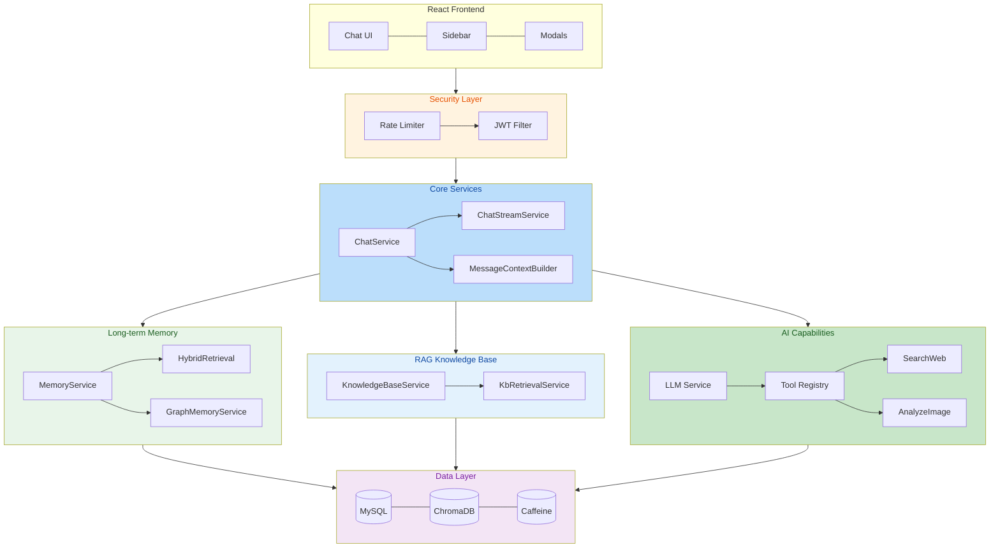

[简体中文](README.md) | English

---

# HanaChat

**AI that remembers, understands, and acts for you.** A multi-model AI chat platform with human-like long-term memory and RAG knowledge base, featuring autonomous tool calling. Built with Spring Boot 4 + React 19.

> **Live Demo:** [www.man8out.xyz](https://www.man8out.xyz)

---

## Highlights

- **Human-like Long-term Memory** — Four-tier decay + lazy decay: AI "remembers what matters, forgets what doesn't," just like people. Auto extraction, on-demand recall, and a knowledge graph connecting entity relationships.
- **Autonomous Tool Calling** — Function Calling protocol enables AI to decide when to search the web or analyze images, with multi-round Tool Loop orchestration and dual-engine racing.
- **RAG Knowledge Base** — Upload documents → auto chunking → hybrid retrieval (vector + BM25) → Cross-Encoder Rerank. AI answers from your private knowledge.
- **Prompt-Scoped Memory Isolation** — Memories auto-group by System Prompt. Switch roles, switch memory space. Zero configuration.

---

## Features

| Module | Description |
|--------|-------------|
| AI Chat | SSE streaming, multi-model switching, mid-response stop, context persistence |
| Tool Calling | Autonomous web search & image analysis via multi-round Tool Loop |
| Long-term Memory | Four-tier decay, lazy decay, semantic recall, knowledge graph disambiguation |
| RAG Knowledge Base | Document upload → hybrid retrieval → Rerank, multi-format parsing |
| Friend System | PID search, friend requests/private chat, unread badges |
| Billing | Per-model pricing, balance pre-deduction, optimistic-lock billing, daily check-in |
| Admin Panel | User management, model config, usage stats, audit logs |

---

## Quick Start

**Prerequisites:** JDK 17+ / Docker & Docker Compose / Node.js 18+

```bash
# 1. Set up environment variables (.env)
DB_PASSWORD=your_db_password
JWT_SECRET=your_jwt_secret_at_least_32_chars
ENCRYPTION_KEY=your-16-char-aes-key
SILICONFLOW_API_KEY=sk-xxxxx
MEMORY_LLM_API_KEY=sk-xxxxx

# 2. Start all services
docker compose up -d

# 3. Frontend dev (optional)
cd frontend && npm install && npm run dev
```

Open `http://localhost:8080`.

---

## Tech Stack

| Category | Technology |
|----------|-----------|
| Backend | Spring Boot 4 + JDK 17 + Spring Security + JWT |
| Data | MySQL 8.0 + ChromaDB + Caffeine + Flyway |
| AI | OpenAI Function Calling / SSE Streaming / SiliconFlow Embedding / bge-reranker-v2-m3 |
| Retrieval | Hybrid (vector + BM25) + RRF Fusion + Cross-Encoder Rerank |
| Frontend | React 19 + TypeScript + Tailwind CSS + shadcn/ui |
| Deployment | Docker Compose (App + MySQL + ChromaDB) |

---

## Security

- **JWT stateless auth** + Caffeine/MySQL dual-layer token blacklist with "Remember Me"
- **AES-128-GCM encryption** for all API keys; sensitive config via environment variables
- **21 rate-limit rules** covering auth, chat, admin endpoints via Caffeine + AtomicInteger
- **Optimistic-lock billing** (`@Version` + retry) prevents concurrent double-charging
- **SSRF protection**, image upload whitelist, full admin audit logging

---

## Architecture


