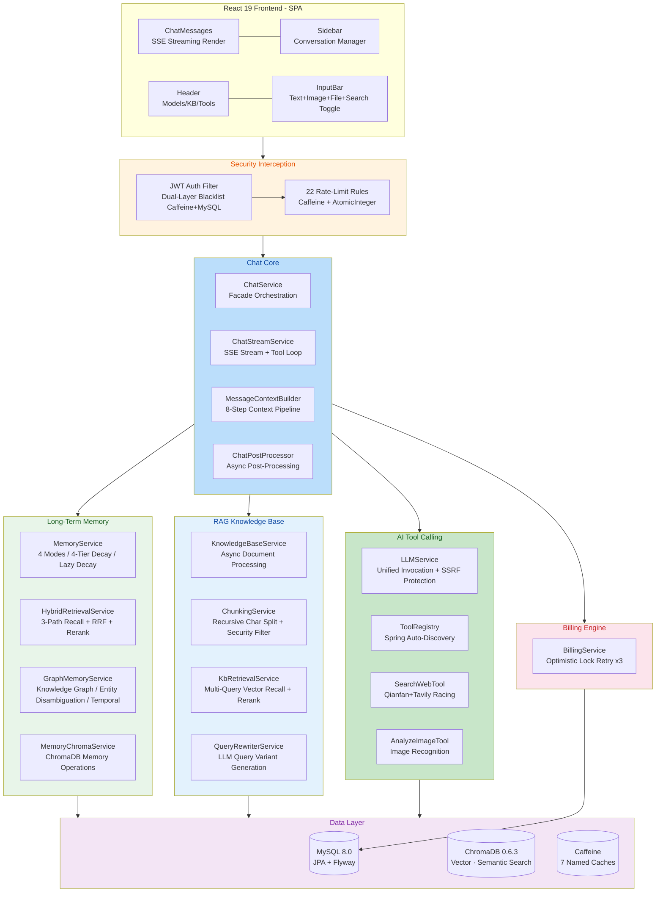

[简体中文](README.md) | English

---

# HanaChat

**AI that remembers, understands.**

A multi-model AI chat platform with human-like long-term memory and RAG knowledge base, featuring autonomous tool calling via Function Calling. Built with Spring Boot 4 + React 19. A live SaaS platform serving 200-500 daily active users.

> **Live Demo:** [www.man8out.xyz](https://www.man8out.xyz)

---

## Highlights

HanaChat is not yet another AI chat wrapper -- it distinguishes itself in four dimensions:

### 🧠 Human-like Long-Term Memory -- Remember Everything, Forget the Irrelevant

Models the complete lifecycle of human memory: **Extract → Store → Decay → Retrieve → Forget**. After each conversation round, the AI asynchronously extracts key facts--preferences, decisions, personal info--and stores them in ChromaDB's vector store. Memories decay with time: full detail within 3 days, compressed summaries by day 7, automatic deletion after 14 days. Yet at any moment, semantic search can instantly retrieve relevant fragments from thousands of memories.

**Key differentiator from other frameworks:** CrewAI, Mem0, LangChain, and others either lack forgetting/decay mechanisms or rely on scheduled cron jobs. HanaChat's unique **lazy decay** mechanism checks timestamps and executes decay only on read--zero idle overhead. Among all frameworks compared, this is the closest implementation to a human memory model.

### 🔧 Autonomous Tool Calling -- AI Decides When to Search and When to Look

A complete tool calling framework built on the OpenAI Function Calling protocol. The AI independently decides when to initiate web searches for real-time information or analyze user-uploaded images. A dual-engine racing mechanism fires Baidu Qianfan and Tavily simultaneously--whichever returns first wins. Tool Loop orchestration lets the AI invoke tools for external information, then generate a response based on the results (limited to 1 tool-call round to ensure fast response times).

### 📚 RAG Knowledge Base -- AI Answers from Your Private Knowledge

A complete document-to-answer pipeline: parsing, intelligent chunking, vectorization, semantic retrieval, and re-ranking. User questions are first rewritten into 2-3 retrieval variants, then undergo multi-query parallel vector recall (ChromaDB, bge-large-zh-v1.5), with RRF fusing multi-variant results, re-scored by a Cross-Encoder model (bge-reranker-v2-m3), with the top-5 results injected into context. To save performance, BM25 keyword search has been removed from the KB; vector recall + Rerank alone provides sufficient precision. Chunking parameters and prompt templates are independently configurable per knowledge base.

### 🎭 Prompt-Scoped Memory Isolation -- Zero-Config Multi-Role Management

Each System Prompt (role configuration) automatically owns an independent memory space and conversation space. Switch to "coding mentor," and only programming-related memories and conversations are loaded; switch to "fitness coach," and only fitness-related ones appear. Memories, conversations, messages, summaries, and knowledge graph expansions are all isolated by prompt. No manual memory switching--true multi-role management with zero configuration.

---

## Feature Matrix

### Chat Engine

| Capability | Details |
|------------|---------|
| **SSE Streaming** | Token-by-token real-time push with typewriter-effect rendering, instant-stop support |
| **Dynamic Model Switching** | Any OpenAI-compatible model, switch mid-conversation, no refresh needed |
| **Persistent Context** | Durable conversation history, up to 30-round history injection, survives page refresh |
| **Multimodal Input** | Text + images + files mixed input; images auto-recognized by vision model |
| **Context Injection Pipeline** | System Rules → Prompt → Long-term Memory → Summary → KB → History → Images/Files → Current Message, strictly ordered 8-step pipeline |

### Human-like Long-Term Memory

The core of the memory system is a **four-tier decay + lazy decay** model, simulating "remember what matters, forget the rest":

| Phase | Time (unvisited) | Status | Behavior |
|-------|-----------------|--------|----------|
| Fresh | 0-3 days | `FULL` | Original text preserved, actively injected into context each conversation |
| Brief | 3-7 days | `BRIEF` | LLM intelligently compresses to ~200-word summary |
| Fading | 7-14 days | `TITLE` | LLM compresses to ~50-word outline, not actively injected |
| Forgotten | 14+ days | Deleted | Permanently removed from ChromaDB + MySQL |

**Five Operational Modes:**

1. **Auto-Extraction**: After each round, asynchronously invokes LLM to extract key facts from the AI's reply, de-duplicates, dual-writes to ChromaDB + MySQL
2. **Default Injection**: Each conversation auto-injects the latest 20 fresh/brief memories, including 1-hop knowledge graph expansion
3. **Semantic Recall**: When users mention related topics, three-path hybrid retrieval searches all memories; hits recover from decayed state
4. **Lazy Decay**: Checks timestamps on read, applies tiered compression or deletion--**no cron jobs, zero idle overhead**
5. **Manual Management**: Support manual add/edit/enable/disable/delete; manual memories never decay

**Security**: Memory content is sanitized via regex Prompt Injection filtering on both extraction and injection sides.

### Knowledge Graph

Memories are not isolated fragments--HanaChat automatically builds an entity-relationship graph:

- **Triple Extraction**: Extract (subject, predicate, object) triples from each memory; LLM annotates entity types
- **Entity Disambiguation**: Auto-identify same person under different names (e.g., "John" and "Mr. Smith"); LLM decides merges
- **Temporal Management**: Each memory carries `valid_from`/`valid_until`; new facts superseding old ones trigger `SUPERSEDED` + cascading relation expiry
- **Graph-Expanded Retrieval**: After semantic search finds seed memories, 1-hop expansion along entity relations; neighbor memories weighted at 0.5
- **Inverse Relations**: 6 pairs of high-frequency predicates (e.g., "works_at" ↔ "has_employee") auto-append inverse edges for complete graph traversal

### Prompt-Scoped Isolation

In traditional solutions, memories and conversations from multiple AI roles blend together, causing role confusion. HanaChat's four-layer isolation:

| Layer | Isolation Mechanism |
|-------|---------------------|
| Memories | `memory_items.prompt_id = NULL` (shared) or `= X` (role X exclusive) |
| Conversations | `conversations.prompt_id` linked to role; auto-isolation on switch |
| Messages | `chat_messages.prompt_id`; history queries filtered by prompt |
| Knowledge Graph | Entities & relations shared at user level; "reverse memory lookup" filtered by prompt_id |

### Conversation Summaries

Solves long-conversation context overflow with an incremental summary strategy:

- Triggers every 20 messages (configurable)
- Keeps last 10 messages in full; compresses the rest into structured summaries
- **Character-Voiced Summaries**: Reads the Prompt name, has the LLM generate summaries from the character's perspective and tone--no dilution of role style
- Incremental merging: appends to existing summaries instead of full regeneration

### Autonomous Tool Calling

A complete plugin-style framework built on the OpenAI Function Calling protocol:

**Core Architecture**
- `ToolRegistry`: Spring auto-discovers all `ToolHandler` implementations; activates tools on demand
- `ToolCallAccumulator`: Handles streaming SSE tool_calls delta accumulation (supports parallel calls), fully compatible with OpenAI streaming protocol
- New tools require only implementing `ToolHandler` and annotating `@Component`

**Tool Loop**
```
User Message → LLM (with tools) → finish_reason="tool_calls"
→ Execute Tools (concurrent) → Inject Results → LLM (without tools)
→ finish_reason="stop" → Generate Final Reply
```
- Limited to 1 round for response speed; single tool timeout 60s, total flow timeout 300s

**Implemented Tools**

| Tool | Function | Implementation |
|------|----------|----------------|
| `search_web` | Web Search | Baidu Qianfan + Tavily dual-engine racing, 5-min Caffeine cache |
| `analyze_image` | Image Analysis | Multimodal LLM, SSRF URL whitelist protection |

**Role Immersion Preservation**: Injects character-voiced instructions alongside tool results ("Rephrase the following information in the tone of your current character"), preventing tool calls from breaking role immersion.

### RAG Knowledge Base

Complete document-to-AI-answer pipeline:

**Document Processing**
- Supports TXT format; parser uses plugin architecture (implement `DocumentParser` interface to extend)
- Recursive character splitting: `\n\n` → `\n` → `。` → `；` → `，` → hard split, with overlap
- Chunk parameters (size/overlap) configurable; max 500 chunks/document
- Async processing with thread pool isolation; uploads return instantly
- Limits: 20MB/file, 200 docs/KB, 1000 docs/user, 500MB storage

**Retrieval Pipeline**
```
Query Rewriting (2-3 variants)
  → Multi-Query Parallel Vector Recall (ChromaDB, bge-large-zh-v1.5)
  → RRF Fusion (multi-variant results)
  → Cross-Encoder Rerank (bge-reranker-v2-m3)
  → Top-5 Context Injection
```

**Per-KB Configurable**
- Chunk Size / Chunk Overlap
- Prompt Template (`{context}` / `{query}` placeholders)
- Query Rewriting toggle

**Security**: Chunk-stage Prompt Injection filtering, file MIME type validation, path traversal protection.

### Billing System

| Capability | Implementation |
|------------|----------------|
| **Per-Model Pricing** | Input/output priced separately at "per 1000 tokens" |
| **Balance Pre-deduction** | 2x estimated pre-deduction (safety factor); settle + release delta after conversation |
| **Optimistic-Lock Retry** | `@Version` + up to 3 retries, `REQUIRES_NEW` transaction isolation |
| **Crash Recovery** | Auto-reclaim users with `reserved_balance > 0` on application restart |
| **Recharge Channels** | Admin recharge + sponsor upload (manual review & credit) |
| **Daily Check-in** | Fixed reward, de-duplicated by date |
| **Cache Strategy** | Balance cache TTL 30s (high-frequency), usage records TTL 2min |

### Friends & Private Chat

- Unique PID search to add friends
- Friend request send/accept/decline management
- One-on-one private chat with read/unread status tracking
- Red-badge unread message notifications

### Prompt Hub Community

- User-defined prompts, shareable to the community hub
- Browse, search, favorite, one-click download to personal library
- Rating and commenting system
- Admin moderation mechanism

### Notification System

- System notification push, unread red-badge indicator
- Single/bulk mark-as-read, delete

---

## Development History

HanaChat has evolved through six major versions, growing from basic AI chat into a mature platform with long-term memory and autonomous tool-calling capabilities:

| Version | Theme | Key Deliverables |
|---------|-------|------------------|
| **v1.0** | Foundation | User system (register/login/JWT/email verification), SSE streaming chat, multi-model switching, web search (Qianfan), prompt hub community, admin panel, token-based billing with sponsor review |
| **v2.0** | Core Intelligence | **Long-term memory system** (four-tier decay + lazy decay + conversation summaries), **RAG knowledge base** (ChromaDB + bge-large-zh embeddings), React frontend migration (Vite + Tailwind), mobile adaptation |
| **v3.0** | Health & Hardening | Full-project health audit (31 issues), database index optimization (full table scans 6→0), Flyway migration introduction, Agent design decisions, tech debt cleanup |
| **v4.0** | Security & Tools | **Environment variable management refactor** (46 @Value → 13 ConfigurationProperties), **AES-128-GCM API Key encryption**, **Tool call refactoring** (context injection → Function Calling), 22 fine-grained rate limits, admin audit logging, persistent login |
| **v5.0** | Memory Deepening | **Hybrid retrieval** (memory system: vector+BM25+knowledge graph three-path recall + RRF fusion + Cross-Encoder Rerank), **knowledge graph** (entities/relations/temporal/disambiguation/graph expansion), **prompt-scoped memory isolation**, memory security hardening (23 risk fixes), PDF/DOCX parsing removed (quality benchmarks not met) |
| **v6.0** | Production Optimization | Performance tuning (removed KB BM25 dual-index freeing 80-120MB, virtual threads, connection pool tightening), Tool Loop limited to 1 round (response speed), 5 production issue fixes (Cloudflare/CSP/CORS/Spring Security 7 compatibility), 8 runtime bug fixes, role-play experience optimization (character-voiced summaries, tool result character instructions), prompt-scoped context isolation extended to conversation layer |

---

## Security

HanaChat has undergone three rounds of security audits (v3.0 health review, v4.0 security assessment, v6.0 code security review); all Critical/High-severity issues have been fully remediated.

### Authentication & Authorization

- **JWT Stateless Auth**: Spring Security + custom JwtAuthenticationFilter, HMAC-SHA256 signing
- **Dual-Layer Token Blacklist**: Caffeine in-memory cache (millisecond latency) + MySQL persistence (survives restart), SHA-256 hashed storage (plaintext never persisted)
- **"Remember Me"**: Frontend dual-storage strategy (default sessionStorage clears on tab close; localStorage for 7-day persistence when opted in)
- **Role Separation**: USER / ADMIN dual roles; admin panel independent auth; `/api/admin/**` requires `ROLE_ADMIN`
- **Login Protection**: 5 req/min rate limit, user enumeration prevention (uniform error messages), mandatory 8-char password strength validation

### Data Encryption

- **AES-128-GCM Authenticated Encryption**: All third-party API keys stored with `ENC:` prefix; key injected via environment variable
- **Auto Migration**: Startup detects and migrates plaintext/legacy-format keys
- **BCrypt**: User password hashing
- **Environment Variable Enforcement**: JWT secret, AES key, admin password, etc. must be injected via environment variables; `docker-compose.yml` uses `:?` syntax for mandatory validation

### API Protection

- **22 Fine-Grained Rate-Limit Rules**: Differentiates login (5/min), chat (30/min), verification codes (1/min), admin (3/min), and more
- **SSRF Protection**: LLM API calls validate URL is non-internal before invoking; image tools validate storage domain against whitelist
- **CORS Whitelist**: Configured via `ALLOWED_ORIGINS` environment variable; strictly restricted in production
- **CSP Security Headers**: `frame-ancestors 'none'` + HSTS + `X-Content-Type-Options: nosniff`
- **Path Traversal Prevention**: File upload UUID renaming + regex filtering for `..`

### Billing Security

- **Optimistic Lock**: `@Version` + 3 retries to prevent concurrent double-charging
- **Balance Pre-deduction**: Lock first, charge later; auto-release on exception
- **Crash Recovery**: Startup scans users with `reserved_balance > 0` and restores balance

### Audit Logging

- 19 admin operation types fully covered (user management, sponsor review, model config, system rules, etc.)
- `@Async` + `REQUIRES_NEW` transaction; non-blocking for primary business flow
- Records operator, target, details (JSON), IP address; immutable and non-deletable

### Known Good Practices

Codebase has **zero SQL injection, zero OS command injection, zero XXE, zero insecure deserialization, zero XSS, zero CSRF, zero open redirect, zero eval/exec**. JPQL fully parameterized; file upload MIME whitelist validation; Docker container runs as non-root user.

---

## Tech Stack

| Category | Technology | Purpose |
|----------|-----------|---------|
| **Backend Framework** | Spring Boot 4.0.6 · JDK 17 · Maven | Full-stack Java backend |
| **Security** | Spring Security · JWT (jjwt 0.12.6) · BCrypt · AES-128-GCM | Auth, authorization, encryption |
| **Data Layer** | MySQL 8.0 · Spring Data JPA · Flyway | Relational data + versioned migrations |
| **Vector DB** | ChromaDB 0.6.3 (REST API) | Semantic vector storage & retrieval |
| **Cache** | Caffeine | 7 named caches, business-tailored TTLs |
| **AI Protocol** | OpenAI-compatible API | Function Calling / SSE Streaming |
| **Embedding Model** | SiliconFlow BAAI/bge-large-zh-v1.5 | 1024-dim Chinese semantic vectors |
| **Rerank Model** | BAAI/bge-reranker-v2-m3 (SiliconFlow) | Cross-Encoder re-ranking |
| **Search** | Baidu Qianfan AI Search · Tavily Search API | Dual-engine racing web search |
| **HTTP Client** | Apache HttpClient 5 | Connection pool 50 + timeout control |
| **Frontend Framework** | React 19 · TypeScript 6.0 · Vite 8 | Modern SPA frontend |
| **UI** | Tailwind CSS 3 · shadcn/ui (Radix UI) · Lucide Icons | Atomic CSS + headless components + icons |
| **Animation** | Motion (Framer Motion) | Declarative React animations |
| **Deployment** | Docker · Docker Compose | 3-service (app + MySQL + ChromaDB) orchestration |
| **Storage** | AWS SDK S3 (compatible) · Local filesystem | Images/files/KB document storage |

---

## Architecture Overview

### System Architecture



### Complete Chat Request Lifecycle

```
1. Client Initiation [React SPA]
   └─ User enters text/image/file, clicks send
   └─ SSE connection established (apiStream → ReadableStream.getReader())

2. Security Interception [Security Layer]
   └─ JWT Auth Filter → parse userId + role
   └─ 22 rules match → window counting + X-RateLimit-* response headers
   └─ Billing pre-deduction → balance → reserved_balance (2x safety factor)

3. Context Assembly [MessageContextBuilder, Strictly Ordered]
   ├─ ① System Rules (global security constraints)
   ├─ ② Custom Prompt (role-defining System Prompt)
   ├─ ③ Long-Term Memory Injection (latest 20 + knowledge graph 1-hop expansion, isolated by prompt_id)
   ├─ ④ Conversation Summary (incremental LLM generation, character-voiced)
   ├─ ⑤ KB Retrieval (query rewrite → multi-query parallel vector recall → Rerank → Top-5)
   ├─ ⑥ History Messages (latest 30 rounds, filtered by prompt_id)
   ├─ ⑦ Image/File References
   └─ ⑧ Current User Message

4. LLM Invocation [ChatStreamService]
   └─ Build OpenAI-compatible request body (model, messages, tools, stream: true)
   └─ SSRF validate API URL in LLMService
   └─ HttpClient5 POST, read raw SSE stream

5. Tool Calling (if AI decides to use tools) [Tool Loop]
   ├─ Phase 1: Detect delta.tool_calls → ToolCallAccumulator fragment accumulation
   ├─ finish_reason="tool_calls" → Execute tools
   │   ├─ search_web: Qianfan + Tavily concurrent → anyOf racing → 2000-char truncation
   │   └─ analyze_image: SSRF URL whitelist → multimodal LLM
   ├─ Inject tool results + character-voiced instructions into messages
   └─ Phase 2: LLM call (without tools), generate final reply (1 round)

6. Streaming Output [SSE Push]
   └─ Line-by-line parse data: JSON → extract content → SseEmitter.send()
   └─ Frontend AsyncGenerator updates UI chunk by chunk (typewriter effect)
   └─ User can handleStop() anytime → AbortController.abort()

7. Post-Processing [ChatPostProcessor @Async]
   ├─ Memory Extraction: LLM analyzes user msg + AI reply → dedup → dual-write ChromaDB + MySQL
   │   └─ Knowledge Graph: extract triples → entity disambiguation → temporal conflict → relation edges
   ├─ Summary Update: check threshold → incremental generate/merge
   └─ Billing Settlement: deduct actual token usage → release reserved delta

8. Persistence
   └─ Messages, memories, token usage records written to MySQL
   └─ Frontend replaces temp IDs with database IDs
   └─ Refresh conversation list (auto-generated titles)
```

---

## Quick Start

### Hardware Requirements

- **Minimum**: 2-core CPU + 4GB RAM (supports 200-500 DAU)
- **Recommended**: 4-core 8GB+

### Prerequisites

- JDK 17+
- Docker & Docker Compose
- Node.js 18+ (frontend dev only)

### 1. Configure Environment

Copy `.env.example` to `.env`:

```bash
#========== Required ==========
DB_PASSWORD=your_db_password
JWT_SECRET=your_secret_at_least_32_characters
ENCRYPTION_KEY=your_16_char_key
ADMIN_USERNAME=admin
ADMIN_PASSWORD=your_admin_password
ADMIN_EMAIL=admin@example.com

#========== AI Services ==========
# SiliconFlow — Embedding + Rerank
SILICONFLOW_API_KEY=sk-xxxxxxxxxxxxx

# Baidu Qianfan — Web Search (primary engine)
QIANFAN_API_KEY=your_qianfan_key

# Tavily — Web Search (racing engine)
TAVILY_API_KEY=tvly-xxxxxxxxxxxxx

# Memory Extraction LLM (recommended: DeepSeek)
MEMORY_LLM_API_KEY=sk-xxxxxxxxxxxxx
MEMORY_LLM_API_URL=https://api.deepseek.com/v1/chat/completions
MEMORY_LLM_MODEL_NAME=deepseek-chat

#========== Optional ==========
# S3 Storage (images/files)
S3_ACCESS_KEY=your_access_key
S3_SECRET_KEY=your_secret_key
S3_URL_PREFIX=https://your-s3-endpoint.com

# SMTP (registration verification codes)
MAIL_USERNAME=your_email@example.com
MAIL_PASSWORD=your_smtp_password

# CORS (set actual domain in production)
ALLOWED_ORIGINS=https://your-domain.com,http://localhost:5173
```

### 2. Start All Services

```bash
docker compose up -d --build
```

Open `http://localhost:8080` after startup. Three containers with resource allocation:

| Service | Image | Port | Memory Limit |
|---------|-------|------|--------------|
| MySQL 8.0 | mysql:8.0 | 3307:3306 | 1024MB |
| ChromaDB 0.6.3 | chromadb/chroma:0.6.3 | 8000:8000 | 384MB |
| HanaChat App | Local build (Dockerfile) | 8080:8080 | 1536MB |

### 3. Frontend Development

```bash
cd frontend
npm install
npm run dev
```

Dev server runs on `http://localhost:5173`, proxying API requests to `localhost:8080` via Vite.

### 4. Production Deployment Checklist

- [ ] Set `ALLOWED_ORIGINS` to your actual domain
- [ ] Ensure `DB_PASSWORD` / `JWT_SECRET` / `ENCRYPTION_KEY` use strong random values
- [ ] Remove MySQL external port exposure (comment out `3307:3306` in `docker-compose.yml`)
- [ ] Configure SMTP email service
- [ ] Add conversation models and configure pricing in the admin model config panel
- [ ] Ensure Cloudflare Bot Fight Mode is disabled (interferes with SSE streams)

---

## Project Structure

```
aichat/
├── src/main/java/com/example/aichat/
│   ├── AichatApplication.java           # Entry (admin init + balance recovery + key migration)
│   ├── config/                           # Configuration layer
│   │   ├── SecurityConfig.java          # Spring Security 7 (JWT + CSP + HSTS + static resource adapter)
│   │   ├── JwtAuthenticationFilter.java # JWT parse → userId + role → SecurityContext
│   │   ├── RateLimitInterceptor.java    # 22 fine-grained rules (Caffeine + AtomicInteger windows)
│   │   ├── TokenBlacklist.java          # Dual-layer blacklist (Caffeine cache + MySQL persistence)
│   │   ├── GlobalExceptionHandler.java  # Unified error handling (no internal info leakage)
│   │   ├── ApiKeyEncryptor.java         # JPA Converter — API Key AES-128-GCM field-level encryption
│   │   ├── WebConfig.java               # CORS whitelist + 8 upload directory static mappings
│   │   ├── AppConfig.java               # HttpClient5 connection pool + 3 thread pools
│   │   ├── CacheConfig.java             # 7 Caffeine named caches
│   │   ├── FlywayConfig.java            # DB versioned migration (manually wired for SB4)
│   │   ├── ChromaDBLauncher.java        # Auto start/stop subprocess (15s readiness wait)
│   │   └── props/                       # 14 @ConfigurationProperties (startup validation enforced)
│   ├── controller/                       # Controller layer (15 frontend + 11 admin)
│   │   ├── ChatController.java          # SSE streaming + non-streaming dual endpoints
│   │   ├── AuthController.java          # Register/login/password reset (TOCTOU-aware)
│   │   ├── KnowledgeBaseController.java # KB CRUD + document upload/reindex
│   │   ├── MemoryController.java        # Memory CRUD + search + enable/disable + clear
│   │   ├── BillingController.java       # Balance/usage/checkin/sponsor upload
│   │   ├── FriendController.java        # PID search + friend request/private chat
│   │   ├── PromptsHubController.java    # Prompt hub (upload/download/rating)
│   │   └── admin/                       # Admin panel (dashboard/users/models/usage/audit/conversations/rules)
│   ├── service/                          # Service layer (30+ services)
│   │   ├── ChatService.java             # Facade: validate → context → billing → dispatch → post-process
│   │   ├── ChatStreamService.java       # SSE streaming core (180+ line Tool Loop implementation)
│   │   ├── ChatPostProcessor.java       # Async orchestration: memory extraction + summary generation
│   │   ├── MessageContextBuilder.java   # 8-step context pipeline (200+ line ordered assembly)
│   │   ├── MemoryService.java           # Four-mode memory (extract/inject/recall/decay)
│   │   ├── GraphMemoryService.java      # Knowledge graph: disambiguation + temporal conflict + graph expansion
│   │   ├── HybridRetrievalService.java  # Three-path recall (vector + graph) → RRF → Rerank
│   │   ├── KnowledgeBaseService.java    # KB CRUD + async document processing + quota checks
│   │   ├── KbRetrievalService.java      # Multi-query parallel → RRF fusion → Rerank
│   │   ├── ChunkingService.java         # Recursive char split + Prompt Injection filtering
│   │   ├── QueryRewriterService.java    # LLM query rewriting (2-3 variants)
│   │   ├── LLMService.java              # Unified LLM invocation (SSRF protection + token estimation)
│   │   ├── BillingService.java          # Optimistic-lock billing (@Version + 3 retries + self-injection)
│   │   ├── SummaryService.java          # Incremental summary + character-voiced tone
│   │   ├── SiliconFlowEmbeddingService.java # 1024-dim vectorization
│   │   ├── SiliconFlowRerankService.java    # Cross-Encoder rerank + graceful degradation
│   │   ├── TavilySearchService.java     # Tavily search API wrapper
│   │   ├── SearchService.java           # Baidu Qianfan search API wrapper
│   │   ├── ChromaDBService.java         # Collection `kb_{id}` + batch operations
│   │   ├── MemoryChromaService.java     # Collection `mem_{userId}` + memory operations
│   │   ├── BaseChromaDBService.java     # ChromaDB V2 REST API abstract base class
│   │   ├── EntityRetrievalService.java  # Knowledge graph entity retrieval
│   │   ├── parser/                      # Document parsers (TxtParser + DocumentParser interface)
│   │   └── tool/                        # Tool calling framework (8 files)
│   │       ├── ToolRegistry.java        # Spring auto-discovery + dynamic activation
│   │       ├── ToolCallAccumulator.java # Streaming delta fragment accumulation (parallel call support)
│   │       ├── SearchWebTool.java       # Qianfan + Tavily racing + Caffeine cache
│   │       └── AnalyzeImageTool.java    # SSRF whitelist + multimodal recognition
│   ├── model/                            # JPA entities (26)
│   ├── repository/                       # Spring Data JPA repositories (27)
│   ├── dto/                              # Data Transfer Objects (20)
│   └── util/                             # Utilities (JwtUtil · AESUtil · NetworkUtils)
├── src/main/resources/
│   ├── application.properties           # Shared business params (memory decay/summary/RAG/embedding)
│   ├── application-dev.properties       # Local dev (127.0.0.1)
│   ├── application-prod.properties      # Production (Docker internal addresses)
│   └── db/migration/                    # 16 Flyway migration scripts (V1-V15)
├── frontend/                             # React 19 frontend
│   ├── src/
│   │   ├── App.tsx                      # Single page-level component (15+ useState, all hook orchestration)
│   │   ├── main.tsx                     # Entry (ErrorBoundary → ToastProvider → AuthProvider)
│   │   ├── index.css                    # Tailwind CSS entry
│   │   ├── components/
│   │   │   ├── chat/                    # ChatMessages (smart scrolling) · ConversationList (two-step delete)
│   │   │   ├── layout/                  # Header (three-section layout) · InputBar (auto-height + send/stop toggle)
│   │   │   ├── modals/                  # 8 modal dialogs (profile/wallet/prompt/message/friend/KB/memory/new conv)
│   │   │   └── shared/                  # BrandIcon · KBSelector · ModelSelector · WebSearchToggle
│   │   └── lib/
│   │       ├── api.ts                   # HTTP layer (SSE AsyncGenerator + 401 auto-redirect)
│   │       ├── auth.tsx                 # AuthContext (React Context auth state management)
│   │       ├── services.ts              # API interface layer (40+ endpoints + TypeScript type defs)
│   │       ├── toast.tsx                # Toast notification system (3 types · 5 max · 3.5s auto-dismiss)
│   │       └── hooks/                   # 8 custom hooks
│   │           ├── useChat.ts           # SSE streaming lifecycle (AbortController + re-entrancy lock)
│   │           ├── useConversations.ts  # Conversation mgmt (sequence numbers resolve race conditions)
│   │           ├── useBilling.ts        # Balance/usage/checkin
│   │           ├── useNotifications.ts  # Notification list/unread count (optimistic updates)
│   │           ├── useFriends.ts        # Friend system
│   │           ├── useImageUpload.ts    # Image upload (useRef avoids unnecessary re-renders)
│   │           └── useFileUpload.ts     # File upload
│   ├── package.json
│   └── vite.config.ts
├── docker-compose.yml                    # 3-service orchestration (health checks + 6 volumes + resource limits)
├── Dockerfile                            # Multi-stage build (eclipse-temurin:17-jre-alpine · non-root)
├── entrypoint.sh                         # Container entrypoint script
├── .env.example                          # Environment variable template (18 variables)
├── pom.xml                               # Maven build (Spring Boot 4.0.6 + 20+ dependencies)
└── PlansDocs/                            # Project docs (v1.0 → v6.0, 50+ design/analysis/audit reports)
```

---

## License

MIT
