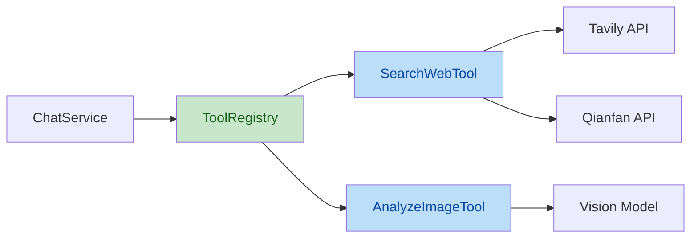
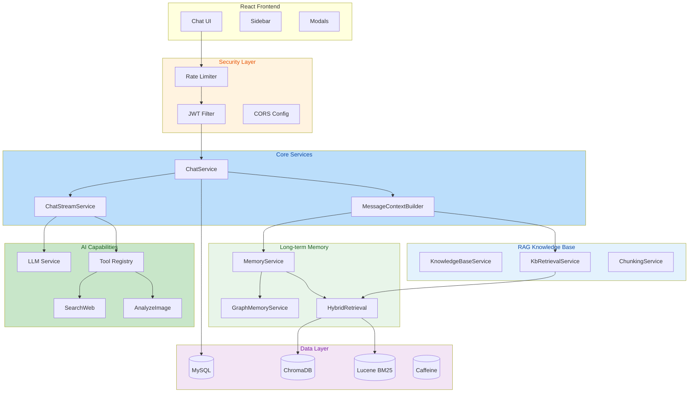

[简体中文](README.md) | English

---

# HanaChat

A multi-model AI chat platform built with Spring Boot 4 + React 19, featuring Tool Calling, RAG knowledge base, human-like long-term memory, knowledge graph, friend system, token billing, and admin dashboard.

---

## Features

| Module | Description |
|--------|-------------|
| AI Chat | SSE streaming, multi-model switching, mid-response stop, context retention |
| Tool Calling | AI autonomously invokes web search & image analysis via multi-round Tool Loop |
| Prompt System | Custom System Prompts, community prompt hub with featured/likes |
| RAG Knowledge Base | TXT/MD upload → auto chunking → vector+BM25 hybrid retrieval → Rerank ranking |
| Long-term Memory | Human-like memory: four-tier decay, lazy decay, semantic recall, knowledge graph |
| Friend System | PID search, friend requests/private chat, unread message badges |
| Billing | Per-model token pricing, balance pre-deduction, sponsor top-up, daily check-in |
| Admin Panel | User management, model config, usage stats, sponsor review, audit logs |

---

## Technical Highlights

### 1. Tool Calling

A custom tool-calling framework based on the OpenAI Function Calling protocol, enabling AI to autonomously decide whether to use web search or image analysis.

```
User Query → LLM returns tool_calls → ToolRegistry executes → Phase 2 injection → LLM generates final reply
```

**Architecture:**



- **Plugin-based registration**: `ToolHandler` interface + Spring auto-discovery — new tools require only an interface implementation
- **Multi-round orchestration**: Supports up to `MAX_ROUNDS=3` Tool Loop rounds, parsing `tool_calls` deltas each round
- **Parallel execution**: Multiple tools in the same round run concurrently via `CompletableFuture`
- **Two-tier fallback**: Models without Tool Calling support automatically fall back to pre-injected search results

### 2. Human-Like Long-Term Memory System

#### Four Memory Operation Modes

| Mode | Trigger | Description |
|------|---------|-------------|
| Auto Extraction | Async after AI reply | LLM extracts key facts from conversations and writes to memory store |
| Default Injection | Every context build | Injects the most recent N active memories in reverse chronological order |
| On-demand Recall | Explicit user search | Full-store semantic search for relevant historical memories |
| Lazy Decay | Real-time check on read | Decay checked on access only — no scheduled tasks needed |

```
Clear Phase (full text) → Fuzzy Phase (compressed summary) → Outline Phase (keywords) → Forgotten (archived)
```

#### Prompt-Scoped Isolation

Memories are automatically isolated by System Prompt, enabling role-specific memory without multi-tenancy:

| Memory Type | Description |
|-------------|-------------|
| Shared Memory | Cross-prompt general memories, accessible across all conversations |
| Role-Specific Memory | Bound to a specific System Prompt, invisible to other roles |

- **Auto-attribution**: New memories are automatically assigned to the current conversation's System Prompt
- **Isolated injection**: Context assembly only injects memories matching the current prompt + shared memories
- **Zero config**: No manual role grouping needed — memories automatically follow the prompt

#### Knowledge Graph

```
Triple extraction → Entity nodes → Relationship edges → Bidirectional auto-append
Entity disambiguation (LLM) → Manual merge → Temporal conflict detection
```

- LLM automatically extracts `(EntityA, Relation, EntityB)` triples from memory content
- Synonymous entities can be manually merged with alias mapping
- Detects temporal conflicts between old and new memories (e.g., "lives in Beijing" vs "moved to Shanghai")

#### Hybrid Retrieval

On-demand memory recall uses three-path retrieval + RRF fusion + Cross-Encoder reranking:

```
User Query → ChromaDB vector + Lucene BM25 keyword + Knowledge Graph entities
          → RRF (Reciprocal Rank Fusion)
          → Cross-Encoder Rerank
          → Top-K results
```

- **Semantic search**: ChromaDB vector similarity matching, not keyword-based
- **Lazy decay**: Decay conditions evaluated only on read — zero scheduled-task overhead
- **Manual memories**: User-added memories never expire

### 3. SSE Streaming Architecture

Custom SSE parsing engine supporting low-latency streaming and tool call detection:

```
HTTP Response → BufferedReader → SSE Line Parser → tool_calls Detection → Phase 2 Request
```

- **Token estimation**: When the API doesn't return `usage`, tokens are estimated as character count × 1.3 ratio to ensure billing is never missed
- **Hard timeout**: `SSE_TIMEOUT_MS` = 5 minutes, preventing long-connection leaks
- **Graceful termination**: Billing is finalized in `onCompletion` / `onTimeout` callbacks

### 4. Dual-Engine Search Race

Web search uses a Tavily + Qianfan dual-engine concurrent race strategy:

```
Launch Tavily & Qianfan simultaneously → anyOf picks the first result → timeout/failure auto-falls back to the other
```

- `CompletableFuture.anyOf()` for true concurrent racing
- 30-second hard timeout with automatic fallback on single-engine failure
- Search result truncation to prevent excessively long contexts

### 5. Context Assembly Pipeline

Multi-layer context injection in priority order to build the complete conversation prompt:

```
System Rules → Custom Prompt → Long-term Memory → Conversation Summary 
    → RAG Retrieval → History Messages (30) → Image Reference → Current Message
```

- Each layer is an independent module — failures don't affect the main flow (graceful degradation)
- Memory injection refreshes `lastAccessedAt`, driving the lazy decay cycle
- RAG retrieval results include source filename annotations

---

## Security Design

### Authentication & Authorization

| Mechanism | Implementation |
|-----------|---------------|
| Auth Method | JWT stateless authentication with "Remember Me" persistent login |
| Role Isolation | USER / ADMIN dual roles with `@PreAuthorize` + Security Filter double protection |
| Token Blacklist | Caffeine local cache + MySQL persistence dual-layer safeguard |
| Password Policy | BCrypt hashed storage, minimum 8 chars with mixed case & digits |
| Disabled Users | Token invalidated immediately, `enabled` state rechecked on login |

### Data Security

| Protection | Implementation |
|------------|---------------|
| API Key Encryption | AES-256-GCM encrypted storage for all model API Keys, with plaintext migration support |
| Secret Management | All sensitive config via environment variables; `.env` is `.gitignore`d |
| SSRF Protection | `NetworkUtils.validateExternalUrl` blocks internal/loopback/reserved address access |
| Image Upload | Whitelist extension validation (png/jpg/jpeg/gif/webp), rejects non-image files |

### Rate Limiting

17 fine-grained rate-limit rules covering all sensitive endpoints:

| Endpoint | Limit |
|----------|-------|
| `/api/auth/login` | 5 req/min |
| `/api/auth/send-code` | 1 req/min |
| `/api/auth/register` | 3 req/min |
| `/api/chat/**` | 30 req/min |
| `/admin/login` | 3 req/min |
| Sponsor/Upload/Comment etc. | Differentiated by use case |

- High-performance counters via Caffeine cache + `AtomicInteger`
- Response headers include `X-RateLimit-Remaining` / `X-RateLimit-Reset` for client awareness

### HTTP Security Headers

```http
Content-Security-Policy: default-src 'self'; frame-ancestors 'none'
Strict-Transport-Security: max-age=31536000; includeSubDomains
X-Content-Type-Options: nosniff
X-Frame-Options: DENY
```

### Audit & Monitoring

- **Full admin operation audit**: User management, balance changes, model config, sponsor review — all logged
- **Async writes**: `@Async` + independent transaction — never blocks admin operations
- **Auto cleanup**: Audit logs older than 90 days are purged daily at 3 AM
- **Data ownership validation**: All ID-based operations verify `userId` (from JWT auth context, not request params)

### Billing Security

| Protection | Implementation |
|------------|---------------|
| Balance Pre-deduction | Estimate tokens before call and reserve balance; release on failure |
| Optimistic Lock Billing | `@Version` + 3 retries to prevent concurrent double-charging |
| Estimation Fallback | When API returns no usage, estimate from character count to ensure nothing is missed |

---

## Tech Stack

| Category | Technology |
|----------|-----------|
| Backend Framework | Spring Boot 4.0.6 |
| JDK | Eclipse Temurin 17 |
| Database | MySQL 8.0 + Flyway migrations |
| ORM | Spring Data JPA + Hibernate |
| Auth | Spring Security + JJWT 0.12.6 |
| Cache | Caffeine |
| Vector Database | ChromaDB |
| Full-text Search | Lucene (BM25) + SmartChineseAnalyzer |
| Embedding Model | SiliconFlow bge-large-zh-v1.5 (1024-dim) |
| Rerank Model | BAAI/bge-reranker-v2-m3 (Cross-Encoder) |
| HTTP Client | Apache HttpClient 5 |
| Template Engine | Thymeleaf |
| Frontend Framework | React 19 + TypeScript |
| UI Library | Tailwind CSS + shadcn/ui |
| Build | Maven + Vite |
| Containerization | Docker Compose (app + MySQL + ChromaDB) |
| Streaming | SSE (Server-Sent Events) |

---

## Quick Start

### Prerequisites

- JDK 17+
- Docker & Docker Compose
- Node.js 18+ (frontend dev)

### 1. Environment Variables

```env
# Required
DB_PASSWORD=your_db_password
JWT_SECRET=your_jwt_secret_at_least_32_chars
ENCRYPTION_KEY=your-16-char-aes-key
SILICONFLOW_API_KEY=sk-xxxxx

# Memory Extraction (Required)
MEMORY_LLM_API_KEY=sk-xxxxx
MEMORY_LLM_API_URL=https://api.deepseek.com/v1/chat/completions
MEMORY_LLM_MODEL_NAME=deepseek-chat

# Optional
QIANFAN_API_KEY=your_qianfan_api_key
TAVILY_API_KEY=your_tavily_api_key
MAIL_USERNAME=your_email@qq.com
MAIL_PASSWORD=your_email_auth_code
S3_ACCESS_KEY=your_s3_access_key
S3_SECRET_KEY=your_s3_secret_key
```

### 2. Start Services

```bash
# One-click start all services (ChromaDB + MySQL + App)
docker compose up -d

# Frontend dev server
cd frontend
npm install
npm run dev
```

### 3. Access

| Entry | URL |
|-------|-----|
| Chat UI | `http://localhost:8080` |
| Admin Panel | `http://localhost:8080/admin` |
| Prompt Hub | `http://localhost:8080/workshop` |
| KB Manager | `http://localhost:8080/kb-manager` |
| Memory Manager | `http://localhost:8080/memory-manager` |

---

## Project Structure

```
aichat/
├── frontend/                    # React frontend
│   └── src/
│       ├── components/
│       │   ├── chat/            # ChatMessages / ConversationList / WelcomeScreen
│       │   ├── layout/          # Header / Sidebar / InputBar
│       │   ├── modals/          # Profile / KB / Memory / Prompt / Friend / Wallet
│       │   ├── shared/          # ModelSelector / KBSelector / WebSearchToggle
│       │   └── ui/              # shadcn/ui components
│       └── lib/
│           ├── hooks/           # useChat / useConversations / useBilling / useFriends
│           ├── api.ts           # HTTP client + SSE stream handler
│           ├── auth.tsx         # AuthContext + AuthProvider
│           └── services.ts      # Business API wrappers
├── src/main/java/com/example/aichat/
│   ├── config/
│   │   ├── SecurityConfig.java          # Spring Security + HTTP security headers
│   │   ├── JwtAuthenticationFilter.java # JWT filter
│   │   ├── RateLimitInterceptor.java    # 17 rate-limit rules
│   │   ├── WebConfig.java              # CORS + static resources
│   │   ├── GlobalExceptionHandler.java  # Global exception handler
│   │   └── props/                       # Type-safe config properties
│   ├── controller/                      # REST API controllers
│   │   └── admin/                       # Admin panel endpoints
│   ├── service/
│   │   ├── ChatService.java             # Chat orchestration facade
│   │   ├── ChatStreamService.java       # SSE streaming core
│   │   ├── MessageContextBuilder.java   # Context assembly
│   │   ├── MemoryService.java           # Long-term memory (4 modes)
│   │   ├── GraphMemoryService.java      # Knowledge graph + entity disambiguation
│   │   ├── HybridRetrievalService.java  # 3-path recall + RRF + Rerank
│   │   ├── ChromaDBService.java         # Vector DB operations
│   │   ├── KbBm25IndexService.java      # KB Lucene BM25 index
│   │   ├── Bm25IndexService.java        # Memory Lucene BM25 index
│   │   ├── LLMService.java              # Low-level LLM calls
│   │   ├── BillingService.java          # Optimistic-lock billing
│   │   ├── AdminAuditLogService.java    # Async audit logging
│   │   ├── KnowledgeBaseService.java    # KB core service
│   │   ├── KbRetrievalService.java      # KB hybrid retrieval orchestrator
│   │   ├── ChunkingService.java         # Recursive character split + injection filter
│   │   ├── QueryRewriterService.java    # LLM query rewriting
│   │   ├── parser/                      # Document parsers
│   │   │   └── TxtParser.java           # TXT/MD plain text parser
│   │   └── tool/                        # Tool Calling framework
│   │       ├── ToolRegistry.java        # Tool registry
│   │       ├── ToolHandler.java         # Tool interface
│   │       ├── SearchWebTool.java       # Dual-engine web search
│   │       └── AnalyzeImageTool.java    # Image analysis
│   ├── model/                           # JPA entities (21)
│   ├── repository/                      # Spring Data JPA (24)
│   └── util/
│       ├── AESUtil.java                 # AES-256-GCM encryption
│       ├── JwtUtil.java                 # JWT signing/verification
│       └── NetworkUtils.java            # SSRF protection
├── src/main/resources/
│   ├── db/migration/                    # Flyway migration scripts
│   ├── templates/                       # Thymeleaf server-side pages
│   └── application*.properties          # Multi-environment config
├── SQL/                                 # Reference SQL scripts
└── docker-compose.yml                   # Container orchestration
```

---

## Architecture Diagram


